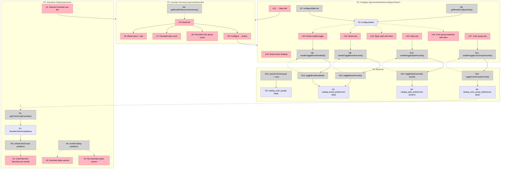

# Issue #640 — Color Group Favorites: Breadboard

Designed from **Selected Shape B** — Standalone "Garment Favorites" nav entry. All DPs resolved in shaping.

---

## Places

| # | Place | Route | Description |
|---|-------|-------|-------------|
| P1 | Garments Catalog | `/garments` | Existing browse page — modified by B5: pre-sorted color groups + styles (favorites first) |
| P2 | Favorites Summary | `/garments/favorites` | NEW read-only: brands with any preference record, per-brand counts, "Configure →" links |
| P3 | Configure Page | `/garments/favorites/configure?brand=[id]` | NEW single-brand write: brand star/enable, style grid with stars, color group swatch grid with stars |
| P4 | Backend | — | Server actions, DB queries, sync pipeline |

---

## UI Affordances

### P1 — Garments Catalog (B1 nav entry + B5 surfacing)

| # | Place | Component | Affordance | Control | Wires Out | Returns To |
|---|-------|-----------|------------|---------|-----------|------------|
| U1 | P1 | sidebar.tsx | "Garment Favorites" nav link (NEW) | click | → P2 | — |
| U2 | P1 | ColorFilterGrid | Color group swatches — favorites pre-sorted first | render | — | — |
| U3 | P1 | GarmentCatalogClient | Favorited styles section (above fold) | render | — | — |
| U4 | P1 | GarmentCatalogClient | Non-favorited styles section | render | — | — |

### P2 — Favorites Summary

| # | Place | Component | Affordance | Control | Wires Out | Returns To |
|---|-------|-----------|------------|---------|-----------|------------|
| U5 | P2 | FavoritesSummaryPage | Brand list (brands with any pref record) | render | — | — |
| U6 | P2 | BrandSummaryRow | Brand name + star indicator (isBrandFavorite) | render | — | — |
| U7 | P2 | BrandSummaryRow | Favorited style count | render | — | — |
| U8 | P2 | BrandSummaryRow | Favorited color group count | render | — | — |
| U9 | P2 | BrandSummaryRow | "Configure →" button | click | → P3 | — |

### P3 — Configure Page

| # | Place | Component | Affordance | Control | Wires Out | Returns To |
|---|-------|-----------|------------|---------|-----------|------------|
| U10 | P3 | ConfigureHeader | Brand name heading | render | — | — |
| U11 | P3 | ConfigureHeader | "← Back" link | click | → P2 | — |
| U12 | P3 | BrandPreferenceControls | Brand star (isFavorite toggle) | click | → N8 | — |
| U13 | P3 | BrandPreferenceControls | Brand enable toggle (isEnabled) | click | → N9 | — |
| U14 | P3 | StyleGrid | Style cards with star per card | render | — | — |
| U15 | P3 | StyleGrid | Style star icon | click | → N10 | — |
| U16 | P3 | ColorGroupGrid | Color group swatches with star overlay | render | — | — |
| U17 | P3 | ColorGroupGrid | Color group star icon | click | → N11 | — |

---

## Code Affordances

### P1 — Garments Catalog (B5 surfacing)

| # | Place | Component | Affordance | Phase | Control | Wires Out | Returns To |
|---|-------|-----------|------------|-------|---------|-----------|------------|
| N1 | P1 | garments/page.tsx | `getColorGroupFavorites(shopId)` | P2 | call | — | → N2 |
| N2 | P1 | GarmentCatalogClient | `favoriteColorGroupNames` — `Set<string>` init | P1 | observe | → S1 | — |
| N3 | P1 | GarmentCatalogClient | `sortedColorGroups` useMemo (favorites first, then alphabetical) | P1 | useMemo | — | → U2 |
| N4 | P1 | GarmentCatalogClient | `sortedCatalog` useMemo (isFavorite=true styles first) | P1 | useMemo | — | → U3, U4 |

**Phase notes:**
- N1 (P2): Reads `catalog_color_group_preferences` (new table from V3). Until V3, this affordance is a stub that returns `[]`.
- N3 (P1): Pure client-side sort using S1. No server dependency. Can be built in V4 with live S1 data.
- N4 (P1): Sorts using existing `isFavorite` flag already populated in `catalog` state via `hydrateCatalogPreferences()`. No new data load needed for style surfacing — flag is already there.

### P2 — Favorites Summary (pure RSC — no client component)

| # | Place | Component | Affordance | Phase | Control | Wires Out | Returns To |
|---|-------|-----------|------------|-------|---------|-----------|------------|
| N5 | P2 | favorites/page.tsx | `getBrandPreferencesSummary(shopId)` | P2 | call | — | → U5–U8 |

**Note:** P2 is a pure React Server Component. All data arrives as props at render time. No client component needed (no interactive elements — "Configure →" is a `<Link>`).

### P3 — Configure Page (RSC loader + client component)

| # | Place | Component | Affordance | Phase | Control | Wires Out | Returns To |
|---|-------|-----------|------------|-------|---------|-----------|------------|
| N6 | P3 | configure/page.tsx | `getBrandConfigureData(shopId, brandId)` | P2 | call | → S2 | — |
| N7 | P3 | FavoritesConfigureClient | `configureState` useState init from props | P1 | write | → S2 | — |
| N8 | P3 | FavoritesConfigureClient | `handleToggleBrandFavorite(value)` | P1→P2 | call | → N12 | → S2 |
| N9 | P3 | FavoritesConfigureClient | `handleToggleBrandEnabled(value)` | P1→P2 | call | → N13 | → S2 |
| N10 | P3 | FavoritesConfigureClient | `handleToggleStyleFavorite(styleId)` | P1→P2 | call | → N14 | → S2 |
| N11 | P3 | FavoritesConfigureClient | `handleToggleColorGroupFavorite(colorGroupId)` | P1→P2 | call | → N15 | → S2 |

**Optimistic update pattern** (same as existing `handleToggleFavorite` in GarmentCatalogClient):
1. Handler reads `configureRef.current` (stale-closure-safe)
2. Optimistic: `setConfigureState(updated)` before await
3. Await server action
4. On failure: `setConfigureState(original)` + toast error

### P4 — Backend (Server Actions + Sync)

| # | Place | Component | Affordance | Phase | Control | Wires Out | Returns To |
|---|-------|-----------|------------|-------|---------|-----------|------------|
| N12 | P4 | actions/favorites.ts | `toggleBrandFavorite(brandId, value)` | P2 | call | → S4 | → N8 |
| N13 | P4 | actions/favorites.ts | `toggleBrandEnabled(brandId, value)` | P2 | call | → S4 | → N9 |
| N14 | P4 | actions/favorites.ts | `toggleStyleFavorite(styleId, value)` | P2 | call | → S5 | → N10 |
| N15 | P4 | actions/favorites.ts | `toggleColorGroupFavorite(colorGroupId, value)` | P2 | call | → S6 | → N11 |
| N16 | P4 | scripts/run-image-sync.ts | `upsertColorGroups(colors)` | P2 | call | → S3 | — |

**Note on N14:** `toggleStyleFavorite` already exists in `garments/actions.ts`. The Configure page calls the same server action — no new action file needed for style favorites. New callers are added via N10.

### Navigation code changes (B1)

| # | Place | Component | Affordance | Phase | Control | Wires Out | Returns To |
|---|-------|-----------|------------|-------|---------|-----------|------------|
| N17 | Global | sidebar.tsx | Add `/garments/favorites` to `SIDEBAR_MAIN_ORDER` | P1 | code | → U1 | — |
| N18 | Global | sidebar.tsx | Remove `/settings/colors` from `SIDEBAR_SETTINGS_ORDER` | P1 | code | — | — |

---

## Data Stores

| # | Place | Store | Type | Description |
|---|-------|-------|------|-------------|
| S1 | P1 | `favoriteColorGroupNames` | `Set<string>` | Color group names favorited by shop; drives pre-sort of ColorFilterGrid |
| S2 | P3 | `configureState` | `ConfigureData` | Brand + styles + colorGroups with current isFavorite/isEnabled; loaded via RSC props, mutated optimistically |
| S3 | P4 | `catalog_color_groups` | DB table | **NEW** — `(id, brand_id, color_group_name)` UNIQUE(brand_id, color_group_name); FK → catalog_brands.id |
| S4 | P4 | `catalog_brand_preferences` | DB table | **NEW** — `(scope_type, scope_id, brand_id, is_enabled, is_favorite)` UNIQUE(scope_type, scope_id, brand_id) |
| S5 | P4 | `catalog_style_preferences` | DB table | **EXISTS** — `(scope_type, scope_id, style_id, is_enabled, is_favorite)` |
| S6 | P4 | `catalog_color_group_preferences` | DB table | **NEW** — `(scope_type, scope_id, color_group_id, is_favorite)` UNIQUE(scope_type, scope_id, color_group_id) |

---

## Mermaid Diagram

---

## Vertical Slices

### Slice Summary

| # | Slice | Parts | New Tables | Demo |
|---|-------|-------|------------|------|
| V1 | Nav + Summary + Brand configure | B1, B2, B3.1 | `catalog_brand_preferences` | "Garment Favorites in sidebar → Configure Gildan → toggle brand star → Summary: Gildan ★" |
| V2 | Style configure | B3.2 | none (table exists) | "Configure Gildan → star PC61 → Summary: 1 favorited style" |
| V3 | Color group configure | B3.3 + B4 (full) | `catalog_color_groups` + `catalog_color_group_preferences` | "Configure Gildan → star Navy + Black → Summary: 2 color groups" |
| V4 | Garments page surfacing | B5 | none | "Browse /garments → Navy swatch first → PC61 floats to top of style list" |

---

### V1: Nav + Summary + Brand Configure

**New tables:** `catalog_brand_preferences`

**What gets built:**
- `sidebar.tsx`: add `/garments/favorites` to `SIDEBAR_MAIN_ORDER`; remove `/settings/colors` from `SIDEBAR_SETTINGS_ORDER`
- `src/app/(dashboard)/garments/favorites/page.tsx` — RSC loading `getBrandPreferencesSummary(shopId)`
- `src/app/(dashboard)/garments/favorites/_components/BrandSummaryRow.tsx`
- `src/app/(dashboard)/garments/favorites/configure/page.tsx` — RSC loading `getBrandConfigureData(shopId, brandId)`
- `src/app/(dashboard)/garments/favorites/configure/_components/FavoritesConfigureClient.tsx` — brand controls only (styles + color groups stubbed)
- `src/app/(dashboard)/garments/favorites/actions.ts` — `toggleBrandFavorite`, `toggleBrandEnabled`, `getBrandPreferencesSummary`, `getBrandConfigureData`
- Drizzle migration: `catalog_brand_preferences` table + indexes
- Drizzle schema: add `catalogBrandPreferences` to `catalog-normalized.ts`

**Affordances in this slice:**

| # | Affordance |
|---|------------|
| U1 | "Garment Favorites" nav link |
| U5–U9 | Full summary page UI |
| U10–U13 | Configure header + brand star + brand enable toggle |
| N5 | `getBrandPreferencesSummary()` |
| N6 | `getBrandConfigureData()` (brand section only) |
| N7 | `configureState` init |
| N8, N9 | `handleToggleBrandFavorite`, `handleToggleBrandEnabled` |
| N12, N13 | `toggleBrandFavorite`, `toggleBrandEnabled` server actions |
| N17, N18 | Sidebar constant changes |
| S4 | `catalog_brand_preferences` DB table |

**Demo:** "Garment Favorites appears in sidebar (Color Settings removed). Click → see brand list. Click Configure Gildan → brand star and enable toggle visible. Toggle star → return → Summary shows Gildan as ★ brand favorite."

---

### V2: Style Configure

**New tables:** none (`catalog_style_preferences` already exists)

**What gets built:**
- `StyleGrid` component in `FavoritesConfigureClient` — style cards with star per card
- `handleToggleStyleFavorite(styleId)` handler in `FavoritesConfigureClient`
- Calls existing `toggleStyleFavorite()` from `garments/actions.ts` (no new server action)
- `getBrandConfigureData()` extended to return styles for brand + their `isFavorite` flags from `catalog_style_preferences`
- Summary `favoritedStyleCount` reflects new star count

**Affordances added:**

| # | Affordance |
|---|------------|
| U14–U15 | Style grid + style star |
| N10 | `handleToggleStyleFavorite()` |
| N14 | `toggleStyleFavorite()` (existing action, new caller via N10) |

**Demo:** "Configure Gildan → see full style grid for Gildan → star PC61 Port & Company → back to Summary → '1 favorited style' shown for Gildan."

---

### V3: Color Group Configure

**New tables:** `catalog_color_groups` + `catalog_color_group_preferences`

**What gets built:**
- Drizzle migration: `catalog_color_groups` + `catalog_color_group_preferences` tables
- Migration backfill: `SELECT DISTINCT brand_id, color_group_name FROM catalog_colors JOIN catalog_styles WHERE color_group_name IS NOT NULL`
- `scripts/run-image-sync.ts`: add `upsertColorGroups(colors)` after writing catalog_colors rows
- `ColorGroupGrid` component in `FavoritesConfigureClient` — swatches with star overlay
- `handleToggleColorGroupFavorite(colorGroupId)` handler
- `toggleColorGroupFavorite(colorGroupId, value)` server action
- `getBrandConfigureData()` extended: returns colorGroups for brand from `catalog_color_groups` + existing preferences from `catalog_color_group_preferences`
- Summary `favoritedColorGroupCount` reflects new star count

**Affordances added:**

| # | Affordance |
|---|------------|
| U16–U17 | Color group swatch grid + star |
| N11 | `handleToggleColorGroupFavorite()` |
| N15 | `toggleColorGroupFavorite()` server action |
| N16 | `upsertColorGroups()` sync pipeline step |
| S3, S6 | `catalog_color_groups`, `catalog_color_group_preferences` DB tables |

**Demo:** "Configure Gildan → see color group swatch grid (Navy, Royal, Black, Sport Grey...) → star Navy + Black → back to Summary → Gildan shows '2 favorited color groups'. Sync pipeline test: new color added to catalog → appears in color group grid on next sync."

---

### V4: Garments Page Surfacing

**New tables:** none (reads S6 added in V3)

**What gets built:**
- `garments/page.tsx`: add `getColorGroupFavorites(shopId)` call → pass `initialFavoriteColorGroupNames: string[]` to `GarmentCatalogClient`
- `GarmentCatalogClient.tsx`:
  - Add `favoriteColorGroupNames: Set<string>` state (init from `initialFavoriteColorGroupNames` prop)
  - Add `sortedColorGroups` useMemo: pre-sort colorGroups by `favoriteColorGroupNames.has(g.colorGroupName)` before passing to ColorFilterGrid
  - Add `sortedCatalog` useMemo: partition catalog into `isFavorite=true` first, then rest — render as two sections with label
- `garments/favorites/actions.ts` extended: `getColorGroupFavorites(shopId)` reads `catalog_color_group_preferences`

**Affordances added:**

| # | Affordance |
|---|------------|
| U2 | ColorFilterGrid — receives pre-sorted colorGroups (modification) |
| U3, U4 | Favorited / non-favorited style sections (new split rendering) |
| N1 | `getColorGroupFavorites(shopId)` |
| N3 | `sortedColorGroups` useMemo |
| N4 | `sortedCatalog` useMemo |
| S1 | `favoriteColorGroupNames` Set |

**Demo:** "Shop has starred Navy, Black for Gildan via V3. Browse /garments → Navy and Black swatches appear first in ColorFilterGrid. Gildan PC61 and G500 (starred in V2) float above non-starred styles in the style grid."

---

## Scope Coverage Verification

| Req | Requirement | Affordances | Covered? |
|-----|-------------|-------------|----------|
| R0 | Favorited items surface first at every garment selection surface | V4: N3 (color group pre-sort), N4 (style sort) | ✅ |
| R1 | Three-tier preferences: brand, style, color group | V1 (brand), V2 (style), V3 (color group) | ✅ |
| R1.1 | Brand favorites — preferred brands sort first | V1: `catalog_brand_preferences.is_favorite`, U12, N12 | ✅ |
| R1.2 | Style favorites per brand | V2: `catalog_style_preferences.is_favorite`, U15, N14 | ✅ |
| R1.3 | Color group favorites at colorGroupName level | V3: `catalog_color_group_preferences`, U17, N15 | ✅ |
| R2 | Customer preferences override shop defaults | Out (V1 cut, DP3 resolved) — tables designed multi-scope from day 1 | ✅ |
| R3 | Read-only cross-brand overview | V1: P2 Summary page (U5–U9, N5) | ✅ |
| R4 | Color/style editing requires single-brand context | P3 design — Configure page always scoped to `?brand=[id]` param | ✅ |
| R5 | Unfavoriting never erases saved selections (soft-delete) | Server actions use upsert with nullable booleans (isFavorite=false vs deleted row) | ✅ |
| R6 | Color preferences stored at colorGroupName level, brand-scoped | V3: `catalog_color_groups(brand_id, color_group_name)` first-class entity | ✅ |
| R7 | Preference data queryable by quote picker | V1–V3 DB tables are queryable; query interface for quote picker is V2 | ✅ (data model) |
| R8 | Bookmarkable URL in app nav | P2 `/garments/favorites`, P3 `/garments/favorites/configure?brand=[id]` | ✅ |

---

## Phase 2 Extensions Table

| ID | Place | Affordance | Replaces | Description |
|----|-------|------------|----------|-------------|
| N1-P2 | P1 | `getColorGroupFavorites()` reads `catalog_color_group_preferences` | N1 (V4, new table) | V4 implements this directly against new table (no Phase 1 version needed — N3/N4 sort logic is Phase 1, but data source is Phase 2 only) |
| N5-P2 | P2 | `getBrandPreferencesSummary()` with customer scope | N5 (V1, shop scope only) | Extend query to accept `scope_type='customer'` param when customers table exists |
| N6-P2 | P3 | `getBrandConfigureData()` with scope param | N6 (V1, shop scope only) | Accept `scope` query param; load customer preference overrides when customer context active |

---

## V2 Forward Reference: Customer Cross-Linking

When the `customers` table ships and R2 (customer scope preferences) is implemented, two cross-linking surfaces belong in the design:

1. **Customer creation → Set catalog preferences**: After creating a customer, offer a "Set catalog preferences →" CTA that navigates to `/garments?scope=customer&customerId=[id]`. This surfaces the garments page in customer scope — color group filter shows shop favorites with customer overrides visible.

2. **Customer record → Preference summary**: Customer profile shows a "Catalog Preferences" row with favorite counts and a link to the Configure page with `?scope=customer&customerId=[id]`. This is the "customer hub" concept — the customer record becomes the entry point for managing their catalog overrides.

The URL-param scope model (`/garments?scope=customer&customerId=[id]`) is already established in `docs/APP_IA.md` — tables ship multi-scope from day 1 per DP3. No architectural changes needed in V2, only new query paths through existing tables.
