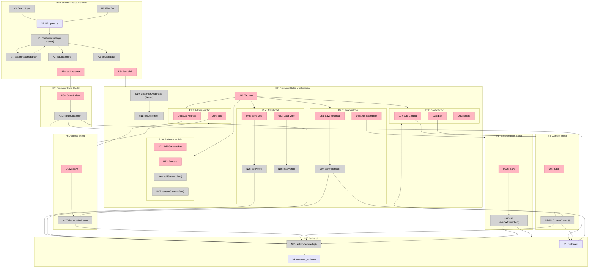

# Customer Vertical — Breadboard

**Pipeline**: `20260228-customer-vertical`
**Stage**: Breadboarding
**Date**: 2026-02-28
**Status**: Complete — Sliced, 8 vertical increments. Reflection applied 2026-02-28.

---

## Places Table

| #    | Place               | Description                                                                  |
| ---- | ------------------- | ---------------------------------------------------------------------------- |
| P1   | Customer List       | `/customers` — server-rendered list with search, filter, sort, pagination    |
| P2   | Customer Detail     | `/customers/[id]` — tabbed view with header stats                            |
| P2.1 | Overview Tab        | Subplace: lifetime stats, recent activity summary, seasonal indicator        |
| P2.2 | Contacts Tab        | Subplace: contact list with role badges, CRUD triggers                       |
| P2.3 | Addresses Tab       | Subplace: labeled address list, CRUD triggers                                |
| P2.4 | Activity Tab        | Subplace: timeline feed, manual note input, type filter                      |
| P2.5 | Financial Tab       | Subplace: payment terms, credit limit, balance bar, tax exemption            |
| P2.6 | Preferences Tab     | Subplace: brand preferences, garment favorites, color preferences            |
| P2.7 | Quotes Tab          | Subplace: linked quotes list (number, status, date, total)                   |
| P2.8 | Jobs Tab            | Subplace: linked jobs list (number, status, lane)                            |
| P2.9 | Invoices Tab        | Subplace: linked invoices list (number, status, balance due)                 |
| P3   | Customer Form Modal | Blocking modal — create or edit customer (same form, pre-populated for edit) |
| P4   | Contact Sheet       | Blocking slide-out — add or edit contact                                     |
| P5   | Address Sheet       | Blocking slide-out — add or edit address                                     |
| P6   | Tax Exemption Sheet | Blocking slide-out — add or edit per-state certificate                       |
| P7   | Backend             | Server Actions + Supabase + domain services                                  |

---

## UI Affordances

### P1: Customer List

| #   | Place | Component           | Affordance                                                                        | Control | Wires Out | Returns To |
| --- | ----- | ------------------- | --------------------------------------------------------------------------------- | ------- | --------- | ---------- |
| U1  | P1    | customer-list-page  | Stats bar (Total, Active, Prospects, Revenue YTD)                                 | render  | —         | —          |
| U2  | P1    | CustomerSearchInput | Search input (debounced 300ms)                                                    | type    | → N5      | —          |
| U3  | P1    | CustomerFilterBar   | Filter chips: lifecycle, health, type, archived                                   | click   | → N6      | —          |
| U4  | P1    | CustomerSortSelect  | Sort selector                                                                     | change  | → N7      | —          |
| U5  | P1    | CustomerTable       | Table rows: company, contact, type badges, lifecycle, health, last order, revenue | render  | —         | —          |
| U6  | P1    | CustomerTableRow    | Row click                                                                         | click   | → P2      | —          |
| U7  | P1    | customer-list-page  | Add Customer button                                                               | click   | → P3      | —          |
| U8  | P1    | customer-list-page  | Pagination controls                                                               | click   | → N8      | —          |
| U9  | P1    | customer-list-page  | Empty state (no results)                                                          | render  | —         | —          |
| U10 | P1    | customer-list-page  | Loading skeleton                                                                  | render  | —         | —          |
| U11 | P1    | CustomerFilterBar   | Archived toggle                                                                   | click   | → N6      | —          |

### P2: Customer Detail Header (shared across all tabs)

| #   | Place | Component            | Affordance                                                                         | Control | Wires Out   | Returns To |
| --- | ----- | -------------------- | ---------------------------------------------------------------------------------- | ------- | ----------- | ---------- |
| U20 | P2    | customer-detail-page | Company name + breadcrumb                                                          | render  | —           | —          |
| U21 | P2    | CustomerHeader       | Lifecycle badge (prospect/new/repeat/contract)                                     | render  | —           | —          |
| U22 | P2    | CustomerHeader       | Health badge (active/potentially-churning/churned)                                 | render  | —           | —          |
| U23 | P2    | CustomerHeader       | Seasonal indicator ("Orders typically in [months]")                                | render  | —           | —          |
| U24 | P2    | CustomerHeader       | Header stats: lifetime revenue, order count, avg order, last order, referral count | render  | —           | —          |
| U25 | P2    | CustomerHeader       | Primary contact quick-copy (name, email, phone)                                    | render  | —           | —          |
| U26 | P2    | CustomerHeader       | Account balance bar (current / limit, color-coded)                                 | render  | —           | —          |
| U27 | P2    | CustomerHeader       | Type tag badges                                                                    | render  | —           | —          |
| U28 | P2    | CustomerHeader       | Edit customer button                                                               | click   | → P3        | —          |
| U29 | P2    | CustomerHeader       | Archive button (with confirmation)                                                 | click   | → N18       | —          |
| U30 | P2    | CustomerTabNav       | Tab navigation (9 tabs)                                                            | click   | → P2.1–P2.9 | —          |

### P2.1: Overview Tab

| #   | Place | Component   | Affordance                                       | Control | Wires Out | Returns To |
| --- | ----- | ----------- | ------------------------------------------------ | ------- | --------- | ---------- |
| U31 | P2.1  | OverviewTab | Recent activity summary (last 3 events)          | render  | —         | —          |
| U32 | P2.1  | OverviewTab | Referral chain display ("Referred by [Company]") | render  | —         | —          |
| U33 | P2.1  | OverviewTab | Quick note input (shortcut to P2.4)              | click   | → P2.4    | —          |

### P2.2: Contacts Tab

| #   | Place | Component   | Affordance                                     | Control | Wires Out | Returns To |
| --- | ----- | ----------- | ---------------------------------------------- | ------- | --------- | ---------- |
| U35 | P2.2  | ContactsTab | Contact list with role badges + primary star   | render  | —         | —          |
| U36 | P2.2  | ContactCard | Contact card: name, email, phone, title, roles | render  | —         | —          |
| U37 | P2.2  | ContactsTab | Add Contact button                             | click   | → P4      | —          |
| U38 | P2.2  | ContactCard | Edit contact button                            | click   | → P4      | —          |
| U39 | P2.2  | ContactCard | Delete contact button (guarded: not last)      | click   | → N26     | —          |
| U40 | P2.2  | ContactsTab | Warning: no ordering contact                   | render  | —         | —          |

### P2.3: Addresses Tab

| #   | Place | Component    | Affordance                                                        | Control | Wires Out | Returns To |
| --- | ----- | ------------ | ----------------------------------------------------------------- | ------- | --------- | ---------- |
| U41 | P2.3  | AddressesTab | Address list: label, type badges, primary designation, city/state | render  | —         | —          |
| U42 | P2.3  | AddressCard  | Address card details                                              | render  | —         | —          |
| U43 | P2.3  | AddressesTab | Add Address button                                                | click   | → P5      | —          |
| U44 | P2.3  | AddressCard  | Edit address button                                               | click   | → P5      | —          |
| U45 | P2.3  | AddressCard  | Delete address button                                             | click   | → N29     | —          |

### P2.4: Activity Tab

| #   | Place | Component     | Affordance                                                              | Control | Wires Out        | Returns To |
| --- | ----- | ------------- | ----------------------------------------------------------------------- | ------- | ---------------- | ---------- |
| U46 | P2.4  | ActivityTab   | Note text input (plain text)                                            | type    | —                | —          |
| U47 | P2.4  | ActivityTab   | Optional entity link selector (quote/job/invoice)                       | change  | —                | —          |
| U48 | P2.4  | ActivityTab   | Save note button                                                        | click   | → N35            | —          |
| U49 | P2.4  | ActivityFeed  | Timeline feed (newest first)                                            | render  | —                | —          |
| U50 | P2.4  | ActivityEntry | Activity entry: timestamp, source icon, direction badge, actor, content | render  | —                | —          |
| U51 | P2.4  | ActivityEntry | Linked entity badge (clickable → detail)                                | click   | → P2.7/P2.8/P2.9 | —          |
| U52 | P2.4  | ActivityTab   | Type filter chips (all, manual, system)                                 | click   | → N38            | —          |
| U53 | P2.4  | ActivityTab   | Load More button                                                        | click   | → N39            | —          |
| U54 | P2.4  | ActivityTab   | Empty state                                                             | render  | —                | —          |

### P2.5: Financial Tab

| #   | Place | Component         | Affordance                                                    | Control | Wires Out | Returns To |
| --- | ----- | ----------------- | ------------------------------------------------------------- | ------- | --------- | ---------- |
| U55 | P2.5  | FinancialTab      | Payment terms dropdown (COD/Upfront/Net-15/Net-30/Net-60)     | change  | —         | —          |
| U56 | P2.5  | FinancialTab      | Pricing tier dropdown (Standard/Preferred/Contract/Wholesale) | change  | —         | —          |
| U57 | P2.5  | FinancialTab      | Discount % field (0–100%)                                     | change  | —         | —          |
| U58 | P2.5  | FinancialTab      | Tax exempt toggle                                             | change  | —         | —          |
| U59 | P2.5  | FinancialTab      | Tax exempt expiry date                                        | change  | —         | —          |
| U60 | P2.5  | FinancialTab      | Tax expiry warning badge (≤30 days)                           | render  | —         | —          |
| U61 | P2.5  | FinancialTab      | Credit limit field (nullable)                                 | change  | —         | —          |
| U62 | P2.5  | AccountBalanceBar | Balance bar: current/$limit, color-coded (green/yellow/red)   | render  | —         | —          |
| U63 | P2.5  | FinancialTab      | Save financial settings button                                | click   | → N30     | —          |
| U64 | P2.5  | TaxExemptionList  | Per-state exemptions list (state, cert#, expiry, verified)    | render  | —         | —          |
| U65 | P2.5  | TaxExemptionList  | Add exemption button                                          | click   | → P6      | —          |
| U66 | P2.5  | TaxExemptionEntry | Edit exemption button                                         | click   | → P6      | —          |
| U67 | P2.5  | TaxExemptionEntry | Expiry warning indicator                                      | render  | —         | —          |

### P2.6: Preferences Tab

| #   | Place | Component            | Affordance                                            | Control | Wires Out | Returns To |
| --- | ----- | -------------------- | ----------------------------------------------------- | ------- | --------- | ---------- |
| U70 | P2.6  | PreferencesTab       | Brand preferences (shop default vs customer override) | render  | —         | —          |
| U71 | P2.6  | GarmentFavoritesList | Garment favorites: style cards                        | render  | —         | —          |
| U72 | P2.6  | GarmentFavoritesList | Add garment favorite (search + add)                   | click   | → N46     | —          |
| U73 | P2.6  | GarmentFavoriteCard  | Remove garment favorite                               | click   | → N47     | —          |
| U74 | P2.6  | ColorPreferences     | Color preferences per brand                           | render  | —         | —          |

### P2.7 / P2.8 / P2.9: Linked Records Tabs

| #   | Place | Component   | Affordance                                       | Control | Wires Out        | Returns To |
| --- | ----- | ----------- | ------------------------------------------------ | ------- | ---------------- | ---------- |
| U75 | P2.7  | QuotesTab   | Linked quotes list (number, status, date, total) | render  | —                | —          |
| U76 | P2.7  | QuoteRow    | Quote row click → quote detail                   | click   | → /quotes/[id]   | —          |
| U77 | P2.8  | JobsTab     | Linked jobs list (number, status, lane)          | render  | —                | —          |
| U78 | P2.8  | JobRow      | Job row click → job detail                       | click   | → /jobs/[id]     | —          |
| U79 | P2.9  | InvoicesTab | Linked invoices (number, status, balance due)    | render  | —                | —          |
| U80 | P2.9  | InvoiceRow  | Invoice row click → invoice detail               | click   | → /invoices/[id] | —          |

### P3: Customer Form Modal

| #   | Place | Component           | Affordance                                        | Control | Wires Out | Returns To |
| --- | ----- | ------------------- | ------------------------------------------------- | ------- | --------- | ---------- |
| U81 | P3    | CreateCustomerModal | Company name field (required)                     | type    | —         | —          |
| U82 | P3    | CreateCustomerModal | Primary contact: first name, last name (required) | type    | —         | —          |
| U83 | P3    | CreateCustomerModal | Contact email / phone (one required)              | type    | —         | —          |
| U84 | P3    | CreateCustomerModal | Type tags multi-select                            | change  | —         | —          |
| U85 | P3    | CreateCustomerModal | Payment terms (optional)                          | change  | —         | —          |
| U86 | P3    | CreateCustomerModal | Referred by customer combobox                     | change  | → N50     | —          |
| U87 | P3    | CreateCustomerModal | Duplicate warning banner                          | render  | —         | —          |
| U88 | P3    | CreateCustomerModal | Save & View button                                | click   | → N20     | —          |
| U89 | P3    | CreateCustomerModal | Cancel button                                     | click   | → P1      | —          |

### P4: Contact Sheet

| #   | Place | Component    | Affordance                                         | Control | Wires Out | Returns To |
| --- | ----- | ------------ | -------------------------------------------------- | ------- | --------- | ---------- |
| U90 | P4    | ContactSheet | First name, last name fields                       | type    | —         | —          |
| U91 | P4    | ContactSheet | Email, phone, title fields                         | type    | —         | —          |
| U92 | P4    | ContactSheet | Roles multi-select (ordering/billing/art-approver) | change  | —         | —          |
| U93 | P4    | ContactSheet | Is Primary toggle                                  | change  | —         | —          |
| U94 | P4    | ContactSheet | Portal access toggle (future)                      | change  | —         | —          |
| U95 | P4    | ContactSheet | Save button                                        | click   | → N24/N25 | —          |
| U96 | P4    | ContactSheet | Close button                                       | click   | → P2.2    | —          |

### P5: Address Sheet

| #    | Place | Component    | Affordance                                  | Control | Wires Out | Returns To |
| ---- | ----- | ------------ | ------------------------------------------- | ------- | --------- | ---------- |
| U97  | P5    | AddressSheet | Label field (freeform, required)            | type    | —         | —          |
| U98  | P5    | AddressSheet | Type select (billing/shipping/both)         | change  | —         | —          |
| U99  | P5    | AddressSheet | Street1, Street2, city, state, zip, country | type    | —         | —          |
| U100 | P5    | AddressSheet | Attention to field                          | type    | —         | —          |
| U101 | P5    | AddressSheet | Primary billing / primary shipping toggles  | change  | —         | —          |
| U102 | P5    | AddressSheet | Save button                                 | click   | → N27/N28 | —          |
| U103 | P5    | AddressSheet | Close button                                | click   | → P2.3    | —          |

### P6: Tax Exemption Sheet

| #    | Place | Component         | Affordance                       | Control | Wires Out | Returns To |
| ---- | ----- | ----------------- | -------------------------------- | ------- | --------- | ---------- |
| U104 | P6    | TaxExemptionSheet | State selector (2-char US state) | change  | —         | —          |
| U105 | P6    | TaxExemptionSheet | Certificate number field         | type    | —         | —          |
| U106 | P6    | TaxExemptionSheet | Document URL / file upload       | change  | —         | —          |
| U107 | P6    | TaxExemptionSheet | Expiry date field                | change  | —         | —          |
| U108 | P6    | TaxExemptionSheet | Verified toggle                  | change  | —         | —          |
| U109 | P6    | TaxExemptionSheet | Save button                      | click   | → N31/N32 | —          |
| U110 | P6    | TaxExemptionSheet | Close button                     | click   | → P2.5    | —          |

---

## Code Affordances

### P1: Customer List — Server Component + Client Inputs

| #   | Place | Component           | Affordance                                                                   | Phase | Control | Wires Out  | Returns To |
| --- | ----- | ------------------- | ---------------------------------------------------------------------------- | ----- | ------- | ---------- | ---------- |
| N1  | P1    | CustomerListPage    | Server component entry — reads `searchParams`                                | 2     | render  | → N4, → N3 | —          |
| N2  | P1    | customerRepo        | `listCustomers(filters, sort, page)`                                         | 2     | call    | → S1       | → U5       |
| N3  | P1    | customerRepo        | `getListStats(shopId)`                                                       | 2     | call    | → S1       | → U1       |
| N4  | P1    | CustomerListPage    | `searchParams` parser (q, lifecycle, health, typeTags, archived, sort, page) | 2     | read    | —          | → N1       |
| N5  | P1    | CustomerSearchInput | Debounced search → `router.replace()` with `?q=`                             | 2     | call    | → S7       | —          |
| N6  | P1    | CustomerFilterBar   | Filter chip click → `router.replace()` with filter params                    | 2     | call    | → S7       | —          |
| N7  | P1    | CustomerSortSelect  | Sort change → `router.replace()` with `?sort=`                               | 2     | call    | → S7       | —          |
| N8  | P1    | CustomerListPage    | Pagination → `router.replace()` with `?page=`                                | 2     | call    | → S7       | —          |

### P2: Customer Detail — Server Component + Header

| #   | Place | Component            | Affordance                                                                                  | Phase | Control | Wires Out                           | Returns To |
| --- | ----- | -------------------- | ------------------------------------------------------------------------------------------- | ----- | ------- | ----------------------------------- | ---------- |
| N10 | P2    | CustomerDetailPage   | Server component entry — reads `[id]`                                                       | 2     | render  | → N11, N12, N13, N14, N15, N16, N17 | —          |
| N11 | P2    | customerRepo         | `getCustomer(id)` — full record with contacts, addresses                                    | 2     | call    | → S1, → N41                         | → U20–U27  |
| N12 | P2    | customerRepo         | `getLinkedQuotes(customerId, page)`                                                         | 2     | call    | → S9                                | → U75      |
| N13 | P2    | customerRepo         | `getLinkedJobs(customerId, page)`                                                           | 2     | call    | → S11                               | → U77      |
| N14 | P2    | customerRepo         | `getLinkedInvoices(customerId, page)`                                                       | 2     | call    | → S10                               | → U79      |
| N15 | P2    | customerActivityRepo | `list(customerId, { page: 0 })`                                                             | 2     | call    | → S4                                | → U49      |
| N16 | P2    | customerRepo         | `getAccountBalance(customerId)` — sum of unpaid invoices                                    | 2     | call    | → S10                               | → U26, U62 |
| N17 | P2    | seasonal-mart        | `getSeasonalData(customerId)` — reads `customer_seasonality_mart` via Drizzle `.existing()` | 2     | call    | → S8                                | → U23      |
| N18 | P2    | CustomerHeader       | `archiveCustomer(id)` confirmation                                                          | 2     | call    | → N22                               | —          |

### P7: Backend — Customer CRUD Server Actions

| #   | Place | Component         | Affordance                                                                 | Phase | Control | Wires Out   | Returns To |
| --- | ----- | ----------------- | -------------------------------------------------------------------------- | ----- | ------- | ----------- | ---------- |
| N20 | P7    | customers/actions | `createCustomer(formData)` — Zod validate, insert, log activity, return id | 2     | call    | → S1, → N36 | → P2       |
| N21 | P7    | customers/actions | `updateCustomer(id, formData)` — validate, update, log activity            | 2     | call    | → S1, → N36 | —          |
| N22 | P7    | customers/actions | `archiveCustomer(id)` — set is_archived, log activity                      | 2     | call    | → S1, → N36 | → P1       |
| N23 | P7    | customers/actions | `duplicateCheck(companyName)` — fuzzy match query                          | 2     | call    | → S1        | → U87      |

### P7: Backend — Contact CRUD Server Actions

| #   | Place | Component         | Affordance                                                   | Phase | Control | Wires Out   | Returns To |
| --- | ----- | ----------------- | ------------------------------------------------------------ | ----- | ------- | ----------- | ---------- |
| N24 | P7    | customers/actions | `createContact(customerId, formData)` — insert, log activity | 2     | call    | → S2, → N36 | → P2.2     |
| N25 | P7    | customers/actions | `updateContact(contactId, formData)` — update, log           | 2     | call    | → S2, → N36 | → P2.2     |
| N26 | P7    | customers/actions | `deleteContact(contactId)` — guards last-contact rule, log   | 2     | call    | → S2, → N36 | → P2.2     |

### P7: Backend — Address CRUD Server Actions

| #   | Place | Component         | Affordance                                                             | Phase | Control | Wires Out | Returns To |
| --- | ----- | ----------------- | ---------------------------------------------------------------------- | ----- | ------- | --------- | ---------- |
| N27 | P7    | customers/actions | `createAddress(customerId, formData)` — insert, update primary flags   | 2     | call    | → S3      | → P2.3     |
| N28 | P7    | customers/actions | `updateAddress(addressId, formData)` — update, recompute primary flags | 2     | call    | → S3      | → P2.3     |
| N29 | P7    | customers/actions | `deleteAddress(addressId)` — delete                                    | 2     | call    | → S3      | → P2.3     |

### P7: Backend — Financial Server Actions

| #   | Place | Component         | Affordance                                                                                              | Phase | Control | Wires Out   | Returns To        |
| --- | ----- | ----------------- | ------------------------------------------------------------------------------------------------------- | ----- | ------- | ----------- | ----------------- |
| N30 | P7    | customers/actions | `saveFinancialSettings(customerId, formData)` — payment terms, tier, discount, credit limit, tax exempt | 2     | call    | → S1, → N36 | → P2.5            |
| N31 | P7    | customers/actions | `createTaxExemption(customerId, formData)` — insert state cert                                          | 2     | call    | → S5, → N36 | → P2.5            |
| N32 | P7    | customers/actions | `updateTaxExemption(exemptionId, formData)` — update cert                                               | 2     | call    | → S5        | → P2.5            |
| N33 | P7    | customers/actions | `checkTaxExemptionByState(customerId, state)` — called from invoice creation                            | 2     | call    | → S5        | → invoice-actions |

### P7: Backend — Activity Timeline Service

| #   | Place | Component                 | Affordance                                                                                                  | Phase | Control | Wires Out | Returns To |
| --- | ----- | ------------------------- | ----------------------------------------------------------------------------------------------------------- | ----- | ------- | --------- | ---------- |
| N35 | P7    | customers/actions         | `addCustomerNote(customerId, content, relatedEntityType?, relatedEntityId?)`                                | 2     | call    | → N36     | → P2.4     |
| N36 | P7    | customer-activity.service | `CustomerActivityService.log(input: ActivityInput)` — domain service, single writer for all activity events | 2     | call    | → N37     | —          |
| N37 | P7    | customerActivityRepo      | `insert(activity)` — append-only write                                                                      | 2     | call    | → S4      | —          |
| N38 | P7    | customerActivityRepo      | `list(customerId, { page, source? })` — paginated read                                                      | 2     | call    | → S4      | → U49      |
| N39 | P7    | customers/actions         | `loadMoreActivities(customerId, page)` — called from Load More button                                       | 2     | call    | → N38     | → U49      |

### P7: Backend — Intelligence Layer

| #   | Place | Component                   | Affordance                                                                                                            | Phase | Control | Wires Out    | Returns To |
| --- | ----- | --------------------------- | --------------------------------------------------------------------------------------------------------------------- | ----- | ------- | ------------ | ---------- |
| —   | P7    | job-actions (jobs vertical) | **TRIGGER: Job Completion** — `completeJob()` server action in the jobs vertical calls N42 after marking job complete | 2     | trigger | → N42        | —          |
| N40 | P7    | customer.rules              | `computeLifecycleProgression(customer, completedOrderCount)` — domain rule, returns new stage or null                 | 2     | call    | —            | → N43      |
| N41 | P7    | customer-health.service     | `computeHealthScore(daysSinceLastOrder, avgOrderInterval)` — returns active/potentially-churning/churned              | 2     | call    | —            | → N11      |
| N42 | P7    | customers/actions           | `checkLifecycleOnOrderEvent(customerId)` — called from job completion; runs N40, calls N43 if progression             | 2     | call    | → N40, → N43 | —          |
| N43 | P7    | customers/actions           | `updateCustomerLifecycle(customerId, stage)` — updates lifecycle_stage, logs activity                                 | 2     | call    | → S1, → N36  | —          |
| N45 | P7    | customerRepo                | `getPreferences(customerId)` — returns favoriteStyleIds[], favoriteColorsByBrand{}                                    | 2     | call    | → S1         | → U71, U74 |
| N46 | P7    | customers/actions           | `addGarmentFavorite(customerId, styleId)`                                                                             | 2     | call    | → S1         | → P2.6     |
| N47 | P7    | customers/actions           | `removeGarmentFavorite(customerId, styleId)`                                                                          | 2     | call    | → S1         | → P2.6     |

### P7: Backend — Cross-Vertical Wiring

| #   | Place | Component                           | Affordance                                                                                                                            | Phase | Control | Wires Out  | Returns To                       |
| --- | ----- | ----------------------------------- | ------------------------------------------------------------------------------------------------------------------------------------- | ----- | ------- | ---------- | -------------------------------- |
| N50 | P7    | customerRepo                        | `searchCustomers(query)` — for quote/invoice customer selector                                                                        | 2     | call    | → S1       | → quote-form, invoice-form       |
| N51 | P7    | customerRepo                        | `getCustomerDefaults(customerId)` — primaryShippingAddress, paymentTerms, pricingTier, taxExemptStatus                                | 2     | call    | → S1, → S3 | → quote-actions, invoice-actions |
| N52 | P7    | address-snapshot.util               | `snapshotAddress(address)` — deep-copies Address to JSONB                                                                             | 2     | call    | —          | → quote-actions, invoice-actions |
| —   | P7    | quote-actions (quotes vertical)     | **TRIGGER: Quote Server Actions** — `createQuote`, `updateStatus→sent/accepted/declined` call N53 after primary operation             | 2     | trigger | → N53      | —                                |
| N53 | P7    | quote-actions                       | `autoLogQuoteEvent(customerId, quoteId, event)` — calls N36                                                                           | 2     | call    | → N36      | —                                |
| —   | P7    | job-actions (jobs vertical)         | **TRIGGER: Job Server Actions** — `createJob`, `updateJobLane`, `completeJob` call N54 after primary operation                        | 2     | trigger | → N54      | —                                |
| N54 | P7    | job-actions                         | `autoLogJobEvent(customerId, jobId, event)` — calls N36                                                                               | 2     | call    | → N36      | —                                |
| —   | P7    | invoice-actions (invoices vertical) | **TRIGGER: Invoice Server Actions** — `createInvoice`, `sendInvoice`, `recordPayment`, `markOverdue` call N55 after primary operation | 2     | trigger | → N55      | —                                |
| N55 | P7    | invoice-actions                     | `autoLogInvoiceEvent(customerId, invoiceId, event)` — calls N36                                                                       | 2     | call    | → N36      | —                                |

### P7: Backend — dbt Analytics Models

| #   | Place | Component  | Affordance                                                                        | Phase | Control | Wires Out | Returns To |
| --- | ----- | ---------- | --------------------------------------------------------------------------------- | ----- | ------- | --------- | ---------- |
| N60 | P7    | dbt/models | `stg_customers` — staging: cast + rename from raw Supabase                        | 2     | dbt run | → S8      | —          |
| N61 | P7    | dbt/models | `dim_customers` — SCD-style snapshot: lifecycle, health, referral chain           | 2     | dbt run | → S8      | —          |
| N62 | P7    | dbt/models | `fct_customer_orders` — one row per order per customer, revenue + status          | 2     | dbt run | → S8      | —          |
| N63 | P7    | dbt/models | `customer_seasonality_mart` — seasonal_score, seasonal_months[], pattern_strength | 2     | dbt run | → S8      | → N17      |
| N64 | P7    | dbt/models | `customer_lifecycle_funnel` — cohort: prospect→new→repeat conversion rates        | 2     | dbt run | → S8      | —          |

---

## Data Stores

| #   | Place | Store                                        | Description                                                                                                         |
| --- | ----- | -------------------------------------------- | ------------------------------------------------------------------------------------------------------------------- |
| S1  | P7    | `customers` table                            | Core customer records — all financial, lifecycle, preference fields                                                 |
| S2  | P7    | `contacts` table                             | Customer contacts with roles + portal flags                                                                         |
| S3  | P7    | `addresses` table                            | Labeled addresses with primary designation per type                                                                 |
| S4  | P7    | `customer_activities` table                  | Append-only activity event log (source, direction, external_ref, related_entity)                                    |
| S5  | P7    | `customer_tax_exemptions` table              | Per-state certs: state, cert_number, doc_url, expiry, verified                                                      |
| S6  | P7    | `customer_groups` + `customer_group_members` | Group membership tables                                                                                             |
| S7  | P1    | Browser URL params                           | `?q=`, `?lifecycle=`, `?health=`, `?typeTags=`, `?archived=`, `?sort=`, `?page=` — source of truth for list filters |
| S8  | P7    | dbt marts                                    | `customer_seasonality_mart`, `dim_customers`, `fct_customer_orders`, `customer_lifecycle_funnel`                    |
| S9  | P7    | `quotes` table                               | With `customer_id` FK, `shipping_address_snapshot JSONB`, `billing_address_snapshot JSONB`                          |
| S10 | P7    | `invoices` table                             | With `customer_id` FK, `billing_address_snapshot JSONB`                                                             |
| S11 | P7    | `jobs` table                                 | With `customer_id` FK (inherited from source quote)                                                                 |

---

## Navigation Flow Diagram

%% NOTE: Server actions (N20, N24/N25, N27/N28, N30, N31/N32, N35, N39) are shown within their
%% triggering Place subgraphs for readability. Authoritative containment is P7 (Backend)
%% per the Code Affordances tables. Tables are the source of truth.



---

## Scope Coverage Verification

| Req | Requirement                               | Key Affordances                            | Covered? |
| --- | ----------------------------------------- | ------------------------------------------ | -------- |
| R0  | Core goal: real Supabase foundation       | N2, N11, N20, S1                           | ✅       |
| R1  | Data Foundation                           | S1–S11 (all tables), N20, N27, N24         | ✅       |
| R2  | Infrastructure layer                      | N20–N32, N35, N36 (server actions + repo)  | ✅       |
| R3  | Customer List                             | N1–N8, U1–U11, S7                          | ✅       |
| R4  | Customer Detail — all tabs                | N10–N17, U20–U80, P2.1–P2.9                | ✅       |
| R5  | Financial Management                      | N30–N33, U55–U67, P6                       | ✅       |
| R6  | Activity Timeline                         | N35–N39, N36 (service), U46–U54, S4        | ✅       |
| R7  | Intelligence Layer                        | N40–N47, N60–N64, S8                       | ✅       |
| R8  | Cross-Vertical Wiring + Portal Foundation | N50–N55, S9, S10, S11, U94 (portal_access) | ✅       |

---

## Vertical Slices

### Slice Summary

| #   | Slice                      | Shape Parts          | Key Affordances                         | Demo Statement                                                                                   |
| --- | -------------------------- | -------------------- | --------------------------------------- | ------------------------------------------------------------------------------------------------ |
| V1  | Customer List Live         | C1, C2.1, C2.4       | N1–N8, U1–U11, S1, S7                   | Navigate to /customers — see real Supabase data, search, filter lifecycle                        |
| V2  | Create Customer + Detail   | C2.2, C2.5           | N10–N17, N20, N23, U20–U34, U81–U89, P3 | Create "Riverside Academy" → land on detail page with real stats                                 |
| V3  | Contact + Address CRUD     | C2.3, C2.2 (actions) | N24–N29, U35–U45, U90–U103, P4, P5      | Add contact with role → appears in Contacts tab. Add labeled address.                            |
| V4  | Activity Timeline          | C3                   | N35–N39, N36 (service), U46–U54, S4     | Add manual note → in timeline. Customer update → system event auto-logged.                       |
| V5  | Financial Management       | C4                   | N30–N33, U55–U67, P6, S5                | Set credit limit $5k → balance bar shows. Add TX tax cert.                                       |
| V6  | Intelligence + Preferences | C5                   | N40–N43, N45–N47, U70–U74, N60–N64      | Lifecycle badge auto-progresses. Health indicator visible. Seasonal shows after dbt.             |
| V7  | Cross-Vertical Wiring      | C6                   | N50–N55, N53, N54, N55, S9, S10, S11    | New quote → customer combobox real → select → address auto-fills → snapshotted. Activity logged. |
| V8  | dbt Analytics              | C7                   | N60–N64, S8, N17, U23                   | Seasonal indicator appears for customer with order history. Lifecycle funnel queryable.          |

---

### Parallelization Windows

```
Wave 0: V1 schema foundation (C1) ─────────────────────────────────────────── SERIAL (critical path)
                                            ↓ (unblocks all below)
Wave 1a: V1 list + V2 create/detail (C2) ──────────────────── PARALLEL with Wave 1b
Wave 1b: V4 activity timeline (C3) ────────────────────────────────────────── PARALLEL with Wave 1a
                                            ↓ (both complete)
Wave 2a: V5 financial management (C4) ─────────────────────── PARALLEL with Wave 2b
Wave 2b: V6 intelligence + preferences (C5) ───────────────────────────────── PARALLEL with Wave 2a
Wave 2c: V8 dbt models (C7) ───────────────────────────────── PARALLEL with 2a + 2b (anytime post-Wave 0)
                                            ↓ (all complete)
Wave 3:  V7 cross-vertical wiring (C6) ────────────────────────────────────── SERIAL (integrates prior waves)

V3 contact/address CRUD: part of Wave 1a (same agent as core CRUD, same PR)
```

---

### V1: Customer List Live

**Demo**: Navigate to `/customers` → see real customers from Supabase. Search "River City" → filters live. Filter by "Repeat" lifecycle.

| #   | Component           | Affordance                                  | Control | Wires Out | Returns To |
| --- | ------------------- | ------------------------------------------- | ------- | --------- | ---------- |
| N1  | CustomerListPage    | Server component entry — reads searchParams | render  | → N4, N3  | —          |
| N2  | customerRepo        | `listCustomers(filters, sort, page)`        | call    | → S1      | → U5       |
| N3  | customerRepo        | `getListStats(shopId)`                      | call    | → S1      | → U1       |
| N4  | CustomerListPage    | `searchParams` parser                       | read    | —         | → N1       |
| N5  | CustomerSearchInput | Debounced search → URL replace              | call    | → S7      | —          |
| N6  | CustomerFilterBar   | Filter click → URL replace                  | call    | → S7      | —          |
| N7  | CustomerSortSelect  | Sort change → URL replace                   | call    | → S7      | —          |
| N8  | Pagination          | Page change → URL replace                   | call    | → S7      | —          |
| U1  | customer-list-page  | Stats bar                                   | render  | —         | —          |
| U2  | CustomerSearchInput | Search input                                | type    | → N5      | —          |
| U3  | CustomerFilterBar   | Filter chips                                | click   | → N6      | —          |
| U5  | CustomerTable       | Customer table rows                         | render  | —         | —          |
| U6  | CustomerTableRow    | Row click                                   | click   | → P2      | —          |
| U7  | customer-list-page  | Add Customer button                         | click   | → P3      | —          |
| U9  | customer-list-page  | Empty state                                 | render  | —         | —          |
| U10 | customer-list-page  | Loading skeleton                            | render  | —         | —          |
| S1  | Backend             | `customers` table                           | read    | —         | → N2, N3   |
| S7  | Browser             | URL params                                  | write   | —         | → N1       |

---

### V2: Create Customer + Detail Core

**Demo**: Click "Add Customer" → fill in "Riverside Academy" + contact → save → land on detail page showing real header stats, lifecycle badge, empty tabs.

| #   | Component           | Affordance                      | Control | Wires Out   | Returns To |
| --- | ------------------- | ------------------------------- | ------- | ----------- | ---------- |
| N10 | CustomerDetailPage  | Server component — reads `[id]` | render  | → N11–N17   | —          |
| N11 | customerRepo        | `getCustomer(id)`               | call    | → S1        | → U20–U27  |
| N12 | customerRepo        | `getLinkedQuotes(customerId)`   | call    | → S9        | → U75      |
| N13 | customerRepo        | `getLinkedJobs(customerId)`     | call    | → S11       | → U77      |
| N14 | customerRepo        | `getLinkedInvoices(customerId)` | call    | → S10       | → U79      |
| N16 | customerRepo        | `getAccountBalance(customerId)` | call    | → S10       | → U26, U62 |
| N20 | customers/actions   | `createCustomer(formData)`      | call    | → S1, → N36 | → P2       |
| N23 | customers/actions   | `duplicateCheck(companyName)`   | call    | → S1        | → U87      |
| U20 | CustomerHeader      | Company name + breadcrumb       | render  | —           | —          |
| U21 | CustomerHeader      | Lifecycle badge                 | render  | —           | —          |
| U22 | CustomerHeader      | Health badge                    | render  | —           | —          |
| U24 | CustomerHeader      | Header stats                    | render  | —           | —          |
| U81 | CreateCustomerModal | Company name field              | type    | —           | —          |
| U82 | CreateCustomerModal | Contact name fields             | type    | —           | —          |
| U83 | CreateCustomerModal | Email / phone                   | type    | —           | —          |
| U88 | CreateCustomerModal | Save & View button              | click   | → N20       | —          |

---

### V3: Contact + Address CRUD

**Demo**: Open Contacts tab → click "Add Contact" → sheet opens → fill role "Ordering" + email → save → appears in contact list with role badge. Add "Main Office" address.

| #    | Component         | Affordance                            | Control | Wires Out   | Returns To |
| ---- | ----------------- | ------------------------------------- | ------- | ----------- | ---------- |
| N24  | customers/actions | `createContact(customerId, formData)` | call    | → S2, → N36 | → P2.2     |
| N25  | customers/actions | `updateContact(contactId, formData)`  | call    | → S2, → N36 | → P2.2     |
| N26  | customers/actions | `deleteContact(contactId)`            | call    | → S2, → N36 | → P2.2     |
| N27  | customers/actions | `createAddress(customerId, formData)` | call    | → S3        | → P2.3     |
| N28  | customers/actions | `updateAddress(addressId, formData)`  | call    | → S3        | → P2.3     |
| N29  | customers/actions | `deleteAddress(addressId)`            | call    | → S3        | → P2.3     |
| U35  | ContactsTab       | Contact list with role badges         | render  | —           | —          |
| U37  | ContactsTab       | Add Contact button                    | click   | → P4        | —          |
| U95  | ContactSheet      | Save button                           | click   | → N24/N25   | —          |
| U41  | AddressesTab      | Address list                          | render  | —           | —          |
| U43  | AddressesTab      | Add Address button                    | click   | → P5        | —          |
| U102 | AddressSheet      | Save button                           | click   | → N27/N28   | —          |

---

### V4: Activity Timeline

**Demo**: Activity tab shows auto-logged "Customer created" system event from V2. Type a note "Called about fall order" → Save → appears at top of timeline with timestamp and source icon.

| #   | Component                 | Affordance                             | Control | Wires Out  | Returns To |
| --- | ------------------------- | -------------------------------------- | ------- | ---------- | ---------- |
| N35 | customers/actions         | `addCustomerNote(...)`                 | call    | → N36      | → P2.4     |
| N36 | customer-activity.service | `CustomerActivityService.log(input)`   | call    | → N37      | —          |
| N37 | customerActivityRepo      | `insert(activity)`                     | call    | → S4       | —          |
| N38 | customerActivityRepo      | `list(customerId, { page, source? })`  | call    | → S4       | → U49      |
| N39 | customers/actions         | `loadMoreActivities(customerId, page)` | call    | → N38      | → U49      |
| U46 | ActivityTab               | Note text input                        | type    | —          | —          |
| U48 | ActivityTab               | Save note button                       | click   | → N35      | —          |
| U49 | ActivityFeed              | Timeline feed                          | render  | —          | —          |
| U50 | ActivityEntry             | Activity entry                         | render  | —          | —          |
| U51 | ActivityEntry             | Linked entity badge                    | click   | → P2.7/8/9 | —          |
| U52 | ActivityTab               | Type filter chips                      | click   | → N38      | —          |
| U53 | ActivityTab               | Load More button                       | click   | → N39      | —          |

---

### V5: Financial Management

**Demo**: Financial tab → set credit limit $5,000 → save → balance bar shows $0 / $5,000 (green). Add Texas tax exemption → appears in list. 30-day warning shows for near-expiry cert.

| #    | Component         | Affordance                      | Control | Wires Out   | Returns To        |
| ---- | ----------------- | ------------------------------- | ------- | ----------- | ----------------- |
| N30  | customers/actions | `saveFinancialSettings(...)`    | call    | → S1, → N36 | → P2.5            |
| N31  | customers/actions | `createTaxExemption(...)`       | call    | → S5, → N36 | → P2.5            |
| N32  | customers/actions | `updateTaxExemption(...)`       | call    | → S5        | → P2.5            |
| N33  | customers/actions | `checkTaxExemptionByState(...)` | call    | → S5        | → invoice-actions |
| U55  | FinancialTab      | Payment terms dropdown          | change  | —           | —                 |
| U56  | FinancialTab      | Pricing tier dropdown           | change  | —           | —                 |
| U58  | FinancialTab      | Tax exempt toggle               | change  | —           | —                 |
| U61  | FinancialTab      | Credit limit field              | change  | —           | —                 |
| U62  | AccountBalanceBar | Balance bar (color-coded)       | render  | —           | —                 |
| U63  | FinancialTab      | Save financial settings button  | click   | → N30       | —                 |
| U64  | TaxExemptionList  | Per-state exemptions list       | render  | —           | —                 |
| U65  | TaxExemptionList  | Add exemption button            | click   | → P6        | —                 |
| U109 | TaxExemptionSheet | Save button                     | click   | → N31/N32   | —                 |

---

### V6: Intelligence + Preferences

> **Prerequisite**: C5.5 favorites cascade rename must be completed before V6 ships — rename `'global'` → `'shop'` in EntityType across 6 files (see `spike-favorites-cascade.md`). This is a code change, not a runtime affordance.

**Demo**: Lifecycle badge auto-progresses to "New" after first order (via job completion hook). Health badge shows "Potentially Churning" for customer silent for 90+ days. Preferences tab shows garment favorites.

| #   | Component               | Affordance                                   | Control | Wires Out    | Returns To |
| --- | ----------------------- | -------------------------------------------- | ------- | ------------ | ---------- |
| N40 | customer.rules          | `computeLifecycleProgression(...)`           | call    | —            | → N43      |
| N41 | customer-health.service | `computeHealthScore(...)`                    | call    | —            | → N11      |
| N42 | customers/actions       | `checkLifecycleOnOrderEvent(customerId)`     | call    | → N40, → N43 | —          |
| N43 | customers/actions       | `updateCustomerLifecycle(customerId, stage)` | call    | → S1, → N36  | —          |
| N45 | customerRepo            | `getPreferences(customerId)`                 | call    | → S1         | → U71, U74 |
| N46 | customers/actions       | `addGarmentFavorite(...)`                    | call    | → S1         | → P2.6     |
| N47 | customers/actions       | `removeGarmentFavorite(...)`                 | call    | → S1         | → P2.6     |
| U21 | CustomerHeader          | Lifecycle badge (now auto-updated)           | render  | —            | —          |
| U22 | CustomerHeader          | Health badge                                 | render  | —            | —          |
| U23 | CustomerHeader          | Seasonal indicator                           | render  | —            | —          |
| U71 | GarmentFavoritesList    | Garment favorites                            | render  | —            | —          |
| U72 | GarmentFavoritesList    | Add garment favorite                         | click   | → N46        | —          |

---

### V7: Cross-Vertical Wiring

**Demo**: Navigate to New Quote → customer combobox shows real customers → select "River City Brewing" → billing address auto-fills → pricing tier "Preferred" applied → snapshot captured → customer Activity tab shows "Quote Q-001 created" system event.

| #   | Component        | Affordance                                                                               | Control | Wires Out  | Returns To      |
| --- | ---------------- | ---------------------------------------------------------------------------------------- | ------- | ---------- | --------------- |
| N50 | customerRepo     | `searchCustomers(query)`                                                                 | call    | → S1       | → quote-form    |
| N51 | customerRepo     | `getCustomerDefaults(customerId)`                                                        | call    | → S1, → S3 | → quote-actions |
| N52 | address-snapshot | `snapshotAddress(address)`                                                               | call    | —          | → quote/invoice |
| —   | quote-actions    | TRIGGER: Quote Server Actions (createQuote, updateStatus)                                | trigger | → N53      | —               |
| N53 | quote-actions    | `autoLogQuoteEvent(customerId, ...)`                                                     | call    | → N36      | —               |
| —   | job-actions      | TRIGGER: Job Server Actions (createJob, updateJobLane, completeJob)                      | trigger | → N54      | —               |
| N54 | job-actions      | `autoLogJobEvent(customerId, ...)`                                                       | call    | → N36      | —               |
| —   | invoice-actions  | TRIGGER: Invoice Server Actions (createInvoice, sendInvoice, recordPayment, markOverdue) | trigger | → N55      | —               |
| N55 | invoice-actions  | `autoLogInvoiceEvent(customerId, ...)`                                                   | call    | → N36      | —               |

---

### V8: dbt Analytics Models

**Demo**: After order data exists — seasonal indicator appears on "Riverside Academy" showing "Orders typically in Aug–Sep". Lifecycle funnel queryable from dbt.

| #   | Component      | Affordance                    | Control | Wires Out | Returns To |
| --- | -------------- | ----------------------------- | ------- | --------- | ---------- |
| N60 | dbt/models     | `stg_customers`               | dbt run | → S8      | —          |
| N61 | dbt/models     | `dim_customers`               | dbt run | → S8      | —          |
| N62 | dbt/models     | `fct_customer_orders`         | dbt run | → S8      | —          |
| N63 | dbt/models     | `customer_seasonality_mart`   | dbt run | → S8      | → N17      |
| N64 | dbt/models     | `customer_lifecycle_funnel`   | dbt run | → S8      | —          |
| N17 | seasonal-mart  | `getSeasonalData(customerId)` | call    | → S8      | → U23      |
| U23 | CustomerHeader | Seasonal indicator            | render  | —         | —          |

---

## Quality Gate

- [x] Every Place passes the blocking test (sheets/modal block interaction with page behind)
- [x] Every R from shaping has corresponding affordances (scope coverage table above)
- [x] Every U has at least one Wires Out or Returns To
- [x] Every N has a trigger and either Wires Out or Returns To
- [x] Every S has at least one reader and one writer
- [x] No dangling wire references
- [x] 8 slices defined with demo statements
- [x] Phase 2 indicators on all code affordances
- [x] Parallelization windows marked (Waves 1a/1b, 2a/2b/2c run in parallel)
- [x] Mermaid diagram matches tables (tables are truth)
- [x] Breadboard reflection applied — all 9 smells resolved (2026-02-28)

---

## Breadboard Reflection Log

**Date**: 2026-02-28
**Method**: Story traces + naming test + wiring verification

| #   | Smell                                                                                       | Type                  | Fix Applied                                                                              |
| --- | ------------------------------------------------------------------------------------------- | --------------------- | ---------------------------------------------------------------------------------------- |
| 1   | N4 wrong causality — parser wired directly to repo (N2) instead of returning to caller (N1) | Wrong causality       | N1 Wires Out: `→ N4, → N3`; N4 Wires Out: `—`; N4 Returns To: `→ N1`                     |
| 2   | N42 no trigger — "called from job completion" not modeled                                   | Missing path          | Added TRIGGER: Job Completion row → N42 in Intelligence section                          |
| 3   | N41 Returns To `→ S1` contradicts compute-on-read architecture                              | Incoherent wiring     | N41 Returns To changed to `→ N11`; N11 Wires Out adds `→ N41`                            |
| 4   | N53/N54/N55 no triggers — cross-vertical entry points unmodeled                             | Missing path          | Added TRIGGER rows for Quote/Job/Invoice server actions in Cross-Vertical section and V7 |
| 5   | U29 bypassed N18 confirmation — wired directly to N22                                       | Wrong causality       | U29 Wires Out: `→ N22` → `→ N18`                                                         |
| 6   | N44 not a runtime affordance — code change task in affordance table                         | Non-affordance node   | Removed N44; prerequisite note added to V6                                               |
| 7   | P3 named "Create Customer Modal" but also handles edit (U28 → P3)                           | Naming resistance     | P3 renamed to "Customer Form Modal"                                                      |
| 8   | N50 name couples domain search to UI context (`ForCombobox` suffix)                         | Naming resistance     | N50 renamed to `searchCustomers(query)`                                                  |
| 9   | Diagram placed P7 server actions inside frontend place subgraphs                            | Diagram inconsistency | Added authoritative containment note above diagram; N4 added to diagram                  |
