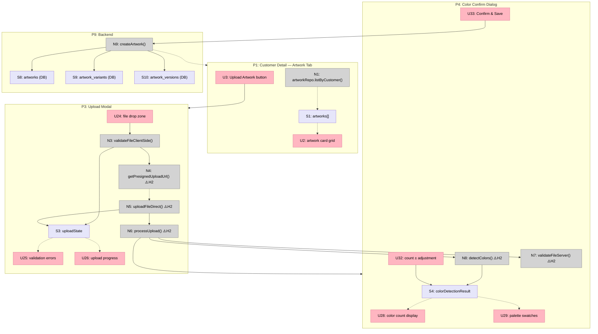
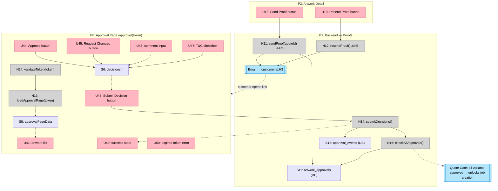

# Artwork Library — Breadboard

**Pipeline**: `20260301-artwork-vertical`
**Stage**: Breadboarding
**Date**: 2026-03-02
**Status**: Reflected ✅

---

## Places

| #    | Place                           | Route / Context                                      | Description                                                                                   |
| ---- | ------------------------------- | ---------------------------------------------------- | --------------------------------------------------------------------------------------------- |
| P1   | Customer Detail — Artwork Tab   | `/customers/[id]` (tab=artwork)                     | Grid of artwork cards per customer. Entry point to upload and artwork drill-down.             |
| P1.1 | Artwork Card                    | (within P1)                                          | Subplace: single card's variant status chips + inline status picker.                          |
| P2   | Artwork Detail                  | `/customers/[id]/artwork/[artworkId]`               | Full artwork view — variant list, version timeline, approval state, proof actions.            |
| P3   | Upload Modal                    | (blocking modal — launched from P1 and P2)          | File drop zone, client validation, upload progress. Auto-advances to P4 on success.           |
| P4   | Color Confirm Dialog            | (blocking dialog — launched from P3)                | Review auto-detected color count + palette. Gary adjusts count, confirms before saving.       |
| P5   | Cross-Customer Artwork View     | `/artwork`                                           | All in-flight artwork across all customers. Filterable by status, customer, date range.       |
| P6   | Approval Page                   | `/approve/{token}` (PUBLIC — no auth middleware)    | Customer-facing proof review. Scrollable artwork list, per-artwork approve/request-changes.   |
| P7   | Quote Builder — Artwork Picker  | (blocking Sheet within `/quotes/new`, `/quotes/[id]/edit`) | Browse and select customer artwork, auto-fills color count, shows live garment mockup. |
| P8   | Production Board — Job Card     | `/jobs/board` (existing place, modified)            | Job cards gain artwork badge (icon + pending count) when variants not fully approved.         |
| P9   | Backend                         | API routes + Supabase                               | Server actions, API route handlers, Drizzle queries, Supabase Storage (H2).                  |
| P10  | Quote Builder                   | `/quotes/new`, `/quotes/[id]/edit` (existing, modified) | Quote creation form. Gains "Select Artwork" button that opens P7 (the artwork picker Sheet). |

---

## UI Affordances

| #   | Place | Component           | Affordance                                    | Control | Wires Out       | Returns To |
| --- | ----- | ------------------- | --------------------------------------------- | ------- | --------------- | ---------- |
| U1  | P1    | customer-detail     | "Artwork" tab                                 | click   | → N1            | —          |
| U2  | P1    | artwork-library     | artwork card grid                             | render  | —               | —          |
| U3  | P1    | artwork-library     | "Upload Artwork" button                       | click   | → P3            | —          |
| U4  | P1    | artwork-card        | artwork card                                  | click   | → P2            | —          |
| U5  | P1    | artwork-card        | artwork thumbnail                             | render  | —               | —          |
| U6  | P1    | artwork-card        | artwork name + variant count                  | render  | —               | —          |
| U7  | P1.1  | artwork-card        | variant status chip                           | click   | → N10           | —          |
| U8  | P1.1  | artwork-card        | inline status picker dropdown                 | render  | —               | —          |
| U9  | P1.1  | artwork-card        | status picker option (Received / In Progress / Proof Sent / Approved) | click | → N10 | — |
| U10 | P1    | artwork-library     | cross-customer link ("View All Artwork")      | click   | → P5            | —          |
| U11 | P2    | artwork-detail      | breadcrumb → customer artwork tab             | click   | → P1            | —          |
| U12 | P2    | artwork-detail      | artwork name (h1)                             | render  | —               | —          |
| U13 | P2    | artwork-detail      | variant list (tabs or accordion)              | render  | —               | —          |
| U14 | P2    | artwork-variant     | version timeline list (newest first)          | render  | —               | —          |
| U15 | P2    | artwork-variant     | version thumbnail                             | render  | —               | —          |
| U16 | P2    | artwork-variant     | internal status chip (clickable)              | click   | → N10           | —          |
| U17 | P2    | artwork-variant     | approval status badge (Approved / Pending / Changes Requested) | render | — | —  |
| U18 | P2    | artwork-variant     | "Send Proof" button (visible when pending version exists) | click | → N11 | —  |
| U19 | P2    | artwork-variant     | "Resend Proof" button (visible when Changes Requested) | click | → N12  | —      |
| U20 | P2    | artwork-variant     | "Upload New Version" button                   | click   | → P3            | —          |
| U21 | P2    | artwork-detail      | "Add Variant" button                          | click   | → P3            | —          |
| U22 | P2    | artwork-variant     | proof snapshot link                           | click   | → external URL  | —          |
| U23 | P2    | artwork-variant     | separation metadata section (post-approval, M6) | render | —              | —          |
| U24 | P3    | upload-modal        | file drop zone / browse file button           | drop/click | → N3          | —          |
| U25 | P3    | upload-modal        | file validation error messages                | render  | —               | —          |
| U26 | P3    | upload-modal        | upload progress indicator                     | render  | —               | —          |
| U27 | P3    | upload-modal        | "Cancel" button                               | click   | → close P3      | —          |
| U28 | P4    | color-confirm       | auto-detected color count (numeric ± spinner) | render  | —               | —          |
| U29 | P4    | color-confirm       | color palette swatches                        | render  | —               | —          |
| U30 | P4    | color-confirm       | PMS match labels per swatch                   | render  | —               | —          |
| U31 | P4    | color-confirm       | "Underbase suggested" badge (conditional)     | render  | —               | —          |
| U32 | P4    | color-confirm       | color count ± adjustment                      | click   | → S4            | —          |
| U33 | P4    | color-confirm       | "Confirm & Save" button                       | click   | → N9            | —          |
| U34 | P4    | color-confirm       | "Cancel" button                               | click   | → close P4      | —          |
| U35 | P5    | cross-artwork-view  | filter bar (status, customer, date range)     | change  | → N16           | —          |
| U36 | P5    | cross-artwork-view  | artwork table rows                            | render  | —               | —          |
| U37 | P5    | cross-artwork-view  | per-row "Send Proof" quick action             | click   | → N11           | —          |
| U38 | P5    | cross-artwork-view  | per-row status chip (clickable)               | click   | → N10           | —          |
| U39 | P5    | cross-artwork-view  | table row                                     | click   | → P2            | —          |
| U40 | P6    | approval-page       | page header ("Proof Review — [Customer Name]") | render | —              | —          |
| U41 | P6    | approval-page       | artwork list (scrollable)                     | render  | —               | —          |
| U42 | P6    | approval-page       | per-artwork thumbnail (large)                 | render  | —               | —          |
| U43 | P6    | approval-page       | per-artwork version notes                     | render  | —               | —          |
| U44 | P6    | approval-page       | per-artwork "Approve" button                  | click   | → S6            | —          |
| U45 | P6    | approval-page       | per-artwork "Request Changes" button          | click   | → S6            | —          |
| U46 | P6    | approval-page       | change request comment input (conditional)    | type    | → S6            | —          |
| U47 | P6    | approval-page       | T&C agreement checkbox                        | click   | → S6            | —          |
| U48 | P6    | approval-page       | "Submit Decision" button (enabled when all artworks have decision + T&C checked) | click | → N14 | — |
| U49 | P6    | approval-page       | success confirmation state                    | render  | —               | —          |
| U50 | P6    | approval-page       | expired token error state                     | render  | —               | —          |
| U51 | P7    | artwork-picker      | customer artwork grid (thumbnails + names)    | render  | —               | —          |
| U52 | P7    | artwork-picker      | selected artwork indicator (checkmark)        | render  | —               | —          |
| U53 | P7    | artwork-picker      | variant selector (if multiple variants)       | click   | → N18, → N19    | —          |
| U54 | P7    | artwork-picker      | color count display (auto-filled, editable)   | render  | —               | —          |
| U55 | P7    | artwork-picker      | live garment mockup                           | render  | —               | —          |
| U56 | P7    | artwork-picker      | "Select" button                               | click   | → N17, → S7     | —          |
| U57 | P8    | job-card            | artwork badge (icon + pending count)          | render  | —               | —          |
| U58 | P8    | job-card            | badge tooltip ("X artwork variants pending")  | hover   | —               | —          |
| U59 | P10   | quote-form          | "Select Artwork" button                       | click   | → P7            | —          |
| U60 | P2    | artwork-variant     | "Save Separations" button (post-approval)     | click   | → N22           | —          |

---

## Code Affordances

> Phase labels: **[P1]** = client-side only (useState, mock data, SVG). **[P2]** = server-side (API route, Drizzle, Supabase). **⚠️ H2** = blocked by File Upload Pipeline horizontal. **⚠️ H3** = blocked by Resend email horizontal.

| #   | Place | Component             | Affordance                                       | Control | Wires Out            | Returns To      |
| --- | ----- | --------------------- | ------------------------------------------------ | ------- | -------------------- | --------------- |
| N1  | P1    | artwork-library       | `[P2]` `artworkRepo.listByCustomer(customerId)` | call    | —                    | → S1            |
| N3  | P3    | upload-modal          | `[P1]` `validateFileClientSide(file)`            | call    | → S3                 | —               |
| N4  | P3    | upload-modal          | `[P2 ⚠️H2]` `getPresignedUploadUrl(name, type)` | call    | —                    | → N5            |
| N5  | P3    | upload-modal          | `[P2 ⚠️H2]` `uploadFileDirect(presignedUrl, file)` | call | → S3, → N6           | —               |
| N6  | P3    | upload-modal          | `[P2 ⚠️H2]` `processUpload(uploadPath)`         | call    | → N7, → N8, → P4    | —               |
| N7  | P9    | artworks-api          | `[P2 ⚠️H2]` `validateFileServer(path)`          | call    | → S3                 | → N6            |
| N8  | P9    | artworks-api          | `[P2 ⚠️H2]` `detectColors(path, fileType)`      | call    | → S4                 | → N6            |
| N9  | P9    | artworks-api          | `[P2]` `createArtwork(data, colorResult)`        | call    | → S8, S9, S10        | → P1            |
| N10 | P9    | artworks-api          | `[P2]` `updateInternalStatus(variantId, status)` | call   | → S9                 | → U7, U16       |
| N11 | P9    | proofs-api            | `[P2 ⚠️H3]` `sendProof(quoteId)`               | call    | → S11, → email       | —               |
| N12 | P9    | proofs-api            | `[P2 ⚠️H3]` `resendProof(quoteId, variantIds[])` | call  | → S11, → email       | —               |
| N13 | P6    | approval-page         | `[P2]` `loadApprovalPage(token)`                | call    | → N24                | → S5            |
| N14 | P9    | approvals-api         | `[P2]` `submitDecisions(token, decisions[])`     | call    | → S12, → N15         | → U49           |
| N15 | P9    | approvals-api         | `[P2]` `checkAllApproved(quoteId)`              | call    | → S11 (gate update)  | —               |
| N16 | P5    | cross-artwork-view    | `[P2]` `artworkRepo.listAcrossCustomers(filters)` | call  | —                    | → U36           |
| N17 | P7    | artwork-picker        | `[P2]` `artworkPicker.loadCustomerArtworks(customerId)` | call | —               | → U51, → S7     |
| N18 | P7    | artwork-picker        | `[P2]` `getConfirmedColorCount(variantId)`      | call    | —                    | → U54           |
| N19 | P7    | artwork-picker        | `[P1]` `renderLiveMockup(variantId, garmentId)` | call    | —                    | → U55           |
| N20 | P9    | artworks-api          | `[P2 ⚠️H2]` `saveFrozenMockup(quoteId, variantId)` | call | → S10               | —               |
| N21 | P8    | job-card              | `[P2]` `getArtworkStatus(quoteId)`              | render  | —                    | → U57, U58      |
| N22 | P9    | separations-api       | `[P2]` `saveSeparationMetadata(versionId, channels[])` | call | → S13           | → U23           |
| N23 | P2    | artwork-detail        | `[P2]` `artworkRepo.getDetail(artworkId)`       | render  | —                    | → S2            |
| N24 | P6    | approval-page         | `[P2]` `validateToken(token)`                   | call    | —                    | → N13           |

---

## Data Stores

| #   | Place | Store                   | Description                                                                    |
| --- | ----- | ----------------------- | ------------------------------------------------------------------------------ |
| S1  | P1    | `artworks[]`            | Customer's artwork list with latest variant status. Written by N1, read by U2–U6. |
| S2  | P2    | `artworkDetail`         | Single artwork with full variant + version tree. Written by N23, read by U13–U23. |
| S3  | P3    | `uploadState`           | `{ file, progress, errors, uploadPath }`. Written by N3/N5, read by U25/U26.  |
| S4  | P4    | `colorDetectionResult`  | `{ colorCount, palette, pmsMatches, confidence, needsUnderbase }`. Written by N8, read by U28–U31. |
| S5  | P6    | `approvalPageData`      | `{ artworks[], customerName, quoteRef, tokenMeta }`. Written by N13, read by U40–U48. |
| S6  | P6    | `decisions[]`           | Per-artwork `{ variantId, decision, comment }` state. Written by U44/U45/U46/U47, read by N14. |
| S7  | P7    | `artworkPickerData`     | Selected artwork + variant + colorCount for quote builder. Written by N17/U56, read by U53/U54/U55. |
| S8  | P9    | `artworks` (DB)         | `(artworkId, customerId, name, serviceType, createdAt)`. Written by N9.        |
| S9  | P9    | `artwork_variants` (DB) | `(variantId, artworkId, name, internalStatus, targetGarmentColor)`. Written by N9/N10. |
| S10 | P9    | `artwork_versions` (DB) | `(versionId, variantId, version, fileUrl, thumbUrl, sha256, colorCount, approvedAt)`. Written by N9/N20. |
| S11 | P9    | `artwork_approvals` (DB)| `(approvalId, quoteId, customerId, token, sentAt, expiresAt, allApprovedAt)`. Written by N11/N12/N15. |
| S12 | P9    | `approval_events` (DB)  | `(eventId, approvalId, variantVersionId, decision, ip, timestamp, tcVersion, comment)`. Append-only. Written by N14. |
| S13 | P9    | `separation_channels` (DB) | `(channelId, versionId, inkColor, pmsCode, role, meshCount, lpi, printOrder)`. Written by N22. |

---

## Mermaid Diagram

### Flow 1: Upload → Color Confirm → Save

### Flow 2: Send Proof → Customer Approval → All-Approved Gate

---

## Vertical Slices

### Slice Summary

| #  | Slice                              | Parts       | H-Dep  | Demo                                                                           |
| -- | ---------------------------------- | ----------- | ------ | ------------------------------------------------------------------------------ |
| V1 | Artwork tab with real data         | A1.1, A1.2  | —      | "Customer detail shows artwork tab — cards with thumbnail, name, variant status" |
| V2 | Upload + client validation         | A3.1, A4.1  | H2     | "Drop a file → client validates format/size → upload progress" ⚠️              |
| V3 | Color detection + confirm          | A4.2–A4.4   | H2     | "After upload, color count auto-detected, Gary adjusts to 3 and confirms" ⚠️  |
| V4 | Artwork detail + status updates    | A1.2, A5    | —      | "Click artwork card → see variants, version timeline, update status inline"    |
| V5 | Send proof + approval page         | A6.1–A6.6   | H3     | "Gary sends proof → customer approves → badge turns green" ⚠️                 |
| V6 | Cross-customer artwork view        | A2.1, A2.2  | —      | "Gary opens /artwork, filters by proof_sent, sees all pending proofs at once"  |
| V7 | Job board artwork badge            | A7.1–A7.3   | —      | "Job card shows artwork icon + '2 pending' when variants not yet approved"     |
| V8 | Quote builder integration          | A8.1–A8.4   | H2 (snapshots) | "Select artwork in quote → color count fills to 4, mockup renders on tee" |
| V9 | Separation metadata                | A9.1–A9.3   | —      | "After approval, art dept fills ink/mesh/LPI form → ScreenRequirement[] generated" |

---

### V1: Artwork Tab with Real Data

**Demo**: "Customer detail shows artwork tab — cards with thumbnail, name, variant count, status chips, last updated."
**Phase**: Phase 2 data; Phase 1 uses mock data reads.

| #   | Component       | Affordance                           | Control | Wires Out | Returns To   |
| --- | --------------- | ------------------------------------ | ------- | --------- | ------------ |
| U1  | customer-detail | "Artwork" tab                        | click   | → N1      | —            |
| U2  | artwork-library | artwork card grid                    | render  | —         | —            |
| U4  | artwork-card    | artwork card                         | click   | → P2      | —            |
| U5  | artwork-card    | artwork thumbnail                    | render  | —         | —            |
| U6  | artwork-card    | artwork name + variant count         | render  | —         | —            |
| U10 | artwork-library | "View All Artwork" link              | click   | → P5      | —            |
| N1  | artwork-library | `artworkRepo.listByCustomer()`       | call    | —         | → S1         |
| S1  | P1              | `artworks[]`                         | write   | store     | → U2, U5, U6 |

---

### V2: Upload + Client Validation

**Demo**: "Drop a PNG → client validates format and size → upload progress bar appears → server confirms."
**Phase**: Phase 2. **⚠️ Blocked by H2** (presigned URL + Supabase Storage bucket).

| #   | Component     | Affordance                              | Control   | Wires Out           | Returns To |
| --- | ------------- | --------------------------------------- | --------- | ------------------- | ---------- |
| U3  | artwork-lib   | "Upload Artwork" button                 | click     | → P3                | —          |
| U24 | upload-modal  | file drop zone / browse                 | drop/click| → N3                | —          |
| U25 | upload-modal  | file validation error messages          | render    | —                   | —          |
| U26 | upload-modal  | upload progress indicator               | render    | —                   | —          |
| U27 | upload-modal  | "Cancel" button                         | click     | → close P3          | —          |
| N3  | upload-modal  | `validateFileClientSide(file)` [P1]     | call      | → S3                | —          |
| N4  | upload-modal  | `getPresignedUploadUrl()` [P2 ⚠️H2]   | call      | —                   | → N5       |
| N5  | upload-modal  | `uploadFileDirect()` [P2 ⚠️H2]        | call      | → S3, → N6          | —          |
| N6  | upload-modal  | `processUpload()` [P2 ⚠️H2]           | call      | → N7, → N8, → P4   | —          |
| S3  | P3            | `uploadState`                            | write     | store               | → U25, U26 |

---

### V3: Color Detection + Confirm

**Demo**: "Auto-detected: 4 colors + underbase. Gary removes underbase, adjusts to 3, clicks Confirm. Artwork appears in library."
**Phase**: Phase 2. **⚠️ Blocked by H2**.

| #   | Component     | Affordance                                | Control | Wires Out | Returns To    |
| --- | ------------- | ----------------------------------------- | ------- | --------- | ------------- |
| U28 | color-confirm | auto-detected color count                 | render  | —         | —             |
| U29 | color-confirm | color palette swatches                    | render  | —         | —             |
| U30 | color-confirm | PMS match labels                          | render  | —         | —             |
| U31 | color-confirm | "Underbase suggested" badge               | render  | —         | —             |
| U32 | color-confirm | color count ± adjustment                  | click   | → S4      | —             |
| U33 | color-confirm | "Confirm & Save" button                   | click   | → N9      | —             |
| U34 | color-confirm | "Cancel" button                           | click   | → close P4| —             |
| N7  | artworks-api  | `validateFileServer()` [P2 ⚠️H2]        | call    | → S3      | → N6          |
| N8  | artworks-api  | `detectColors()` [P2 ⚠️H2]             | call    | → S4      | → N6          |
| N9  | artworks-api  | `createArtwork()` [P2]                    | call    | → S8,S9,S10 | → P1        |
| S4  | P4            | `colorDetectionResult`                    | write   | store     | → U28,U29,U31 |

---

### V4: Artwork Detail + Status Updates

**Demo**: "Click artwork → drill-down shows 2 variants, v1/v2 timeline. Click 'In Progress' status chip → updates to 'Proof Sent' inline."

| #   | Component     | Affordance                               | Control | Wires Out | Returns To      |
| --- | ------------- | ---------------------------------------- | ------- | --------- | --------------- |
| U11 | artwork-detail| breadcrumb → artwork tab                 | click   | → P1      | —               |
| U12 | artwork-detail| artwork name (h1)                        | render  | —         | —               |
| U13 | artwork-detail| variant list                             | render  | —         | —               |
| U14 | artwork-variant| version timeline list                   | render  | —         | —               |
| U15 | artwork-variant| version thumbnail                       | render  | —         | —               |
| U16 | artwork-variant| internal status chip                    | click   | → N10     | —               |
| U17 | artwork-variant| approval status badge                   | render  | —         | —               |
| U20 | artwork-variant| "Upload New Version" button             | click   | → P3      | —               |
| U21 | artwork-detail| "Add Variant" button                     | click   | → P3      | —               |
| U7  | artwork-card  | variant status chip (back in P1)         | click   | → N10     | —               |
| U8  | artwork-card  | inline status picker dropdown            | render  | —         | —               |
| U9  | artwork-card  | status picker option                     | click   | → N10     | —               |
| N23 | artwork-detail| `artworkRepo.getDetail(artworkId)` [P2]  | call    | —         | → S2            |
| N10 | artworks-api  | `updateInternalStatus()` [P2]            | call    | → S9      | → U7, U16       |
| S2  | P2            | `artworkDetail`                           | write   | store     | → U13,U14,U17   |

---

### V5: Send Proof + Approval Page

**Demo**: "Gary clicks Send Proof on J-1034 → email arrives → customer opens link → approves Front Logo, requests changes on Back Text → Gary sees status update → resends for Back Text only → customer approves → quote gate unlocks."
**Phase**: Phase 2. **⚠️ Blocked by H3** (email delivery) for full flow. Approval page itself can be built without H3.

| #   | Component      | Affordance                                              | Control | Wires Out      | Returns To |
| --- | -------------- | ------------------------------------------------------- | ------- | -------------- | ---------- |
| U18 | artwork-variant| "Send Proof" button                                     | click   | → N11          | —          |
| U19 | artwork-variant| "Resend Proof" button                                   | click   | → N12          | —          |
| U40 | approval-page  | page header                                             | render  | —              | —          |
| U41 | approval-page  | artwork list                                            | render  | —              | —          |
| U42 | approval-page  | per-artwork thumbnail                                   | render  | —              | —          |
| U43 | approval-page  | per-artwork version notes                               | render  | —              | —          |
| U44 | approval-page  | per-artwork "Approve" button                            | click   | → S6           | —          |
| U45 | approval-page  | per-artwork "Request Changes" button                    | click   | → S6           | —          |
| U46 | approval-page  | change request comment input                            | type    | → S6           | —          |
| U47 | approval-page  | T&C checkbox                                            | click   | → S6           | —          |
| U48 | approval-page  | "Submit Decision" button                                | click   | → N14          | —          |
| U49 | approval-page  | success state                                           | render  | —              | —          |
| U50 | approval-page  | expired token error state                               | render  | —              | —          |
| N11 | proofs-api     | `sendProof(quoteId)` [P2 ⚠️H3]                        | call    | → S11, → email | —          |
| N12 | proofs-api     | `resendProof(quoteId, variantIds[])` [P2 ⚠️H3]        | call    | → S11, → email | —          |
| N13 | approval-page  | `loadApprovalPage(token)` [P2]                          | call    | → N24          | → S5       |
| N24 | approval-page  | `validateToken(token)` [P2]                             | call    | —              | → N13      |
| N14 | approvals-api  | `submitDecisions(token, decisions[])` [P2]              | call    | → S12, → N15   | → U49      |
| N15 | approvals-api  | `checkAllApproved(quoteId)` [P2]                        | call    | → S11          | —          |
| S5  | P6             | `approvalPageData`                                      | write   | store          | → U41,U42  |
| S6  | P6             | `decisions[]`                                           | write   | store          | → U48, N14 |
| S11 | P9             | `artwork_approvals` (DB)                                | write   | store          | —          |
| S12 | P9             | `approval_events` (DB)                                  | write   | store          | —          |

---

### V6: Cross-Customer Artwork View

**Demo**: "Gary opens /artwork, sets status filter to 'Proof Sent' → sees 3 artworks across 2 customers awaiting approval. Clicks row → drills into artwork detail."

| #   | Component          | Affordance                            | Control | Wires Out | Returns To |
| --- | ------------------ | ------------------------------------- | ------- | --------- | ---------- |
| U35 | cross-artwork-view | filter bar (status, customer, date)   | change  | → N16     | —          |
| U36 | cross-artwork-view | artwork table rows                    | render  | —         | —          |
| U37 | cross-artwork-view | per-row "Send Proof" quick action     | click   | → N11     | —          |
| U38 | cross-artwork-view | per-row status chip                   | click   | → N10     | —          |
| U39 | cross-artwork-view | table row                             | click   | → P2      | —          |
| N16 | cross-artwork-view | `artworkRepo.listAcrossCustomers()` [P2] | call | —         | → U36      |

---

### V7: Job Board Artwork Badge

**Demo**: "Job card for 'River City — Spring Run' shows artwork icon + '2 pending'. When all variants reach Approved, badge becomes green checkmark."

| #   | Component | Affordance                             | Control | Wires Out | Returns To   |
| --- | --------- | -------------------------------------- | ------- | --------- | ------------ |
| U57 | job-card  | artwork badge (icon + pending count)   | render  | —         | —            |
| U58 | job-card  | badge tooltip                          | hover   | —         | —            |
| N21 | job-card  | `artworkStatusSummary(quoteId)` [P2]   | call    | —         | → U57, U58   |

**Integration note**: "Artwork approved" is the first item in the screen print P9 task checklist template. The badge surfaces this task's incomplete state as a contextual icon on the job card's progress bar — not a separate badge system.

---

### V8: Quote Builder Integration

**Demo**: "In the quote builder, Gary clicks 'Select Artwork' → Sheet opens showing River City's 3 artworks → selects 'Front Logo v2' → color count auto-fills to 4 → live mockup renders on selected black tee."

| #   | Component      | Affordance                                      | Control | Wires Out      | Returns To |
| --- | -------------- | ----------------------------------------------- | ------- | -------------- | ---------- |
| U51 | artwork-picker | customer artwork grid                           | render  | —              | —          |
| U52 | artwork-picker | selected artwork indicator                      | render  | —              | —          |
| U53 | artwork-picker | variant selector                                | click   | → N18, → N19   | —          |
| U54 | artwork-picker | color count display (auto-filled, editable)     | render  | —              | —          |
| U55 | artwork-picker | live garment mockup                             | render  | —              | —          |
| U56 | artwork-picker | "Select" button                                 | click   | → N17, → S7    | —          |
| N17 | artwork-picker | `artworkPicker.loadCustomerArtworks()` [P2]     | call    | —              | → U51, S7  |
| N18 | artwork-picker | `getConfirmedColorCount(variantId)` [P2]        | call    | —              | → U54      |
| N19 | artwork-picker | `renderLiveMockup(variantId, garmentId)` [P1]   | call    | —              | → U55      |
| N20 | artworks-api   | `saveFrozenMockup(quoteId, variantId)` [P2 ⚠️H2] | call  | → S10          | —          |
| S7  | P7             | `artworkPickerData`                              | write   | store          | → U53,U54  |

---

### V9: Separation Metadata (M6)

**Demo**: "After 'School Spirit' is approved, art tab shows 'Separation Metadata' section. Gary enters: Ch1=White (underbase, 230 mesh), Ch2=Red (Pantone 185, 230 mesh). ScreenRequirement[] saved and visible to screen room."

| #   | Component      | Affordance                                      | Control | Wires Out | Returns To |
| --- | -------------- | ----------------------------------------------- | ------- | --------- | ---------- |
| U23 | artwork-variant| separation metadata section (post-approval)     | render  | —         | —          |
| U60 | artwork-variant| "Save Separations" button                        | click   | → N22     | —          |
| N22 | separations-api| `saveSeparationMetadata(versionId, channels[])` [P2] | call | → S13   | → U23      |
| S13 | P9             | `separation_channels` (DB)                        | write   | store     | —          |

---

## Phase 2 Extensions Table

These code affordances replace or extend Phase 1 stubs when the relevant horizontals are ready:

| ID  | Place | Affordance                       | Replaces / Extends                | Horizontal Dependency |
| --- | ----- | -------------------------------- | --------------------------------- | --------------------- |
| N4  | P3    | `getPresignedUploadUrl()`        | Mock upload path (Phase 1)        | H2                    |
| N5  | P3    | `uploadFileDirect()`             | Mock upload path (Phase 1)        | H2                    |
| N6  | P3    | `processUpload()`                | Mock upload path (Phase 1)        | H2                    |
| N7  | P9    | `validateFileServer()`           | N/A — new capability              | H2                    |
| N8  | P9    | `detectColors()`                 | N/A — new capability              | H2                    |
| N11 | P9    | `sendProof()` — email delivery   | Can stub (log token to console)   | H3                    |
| N12 | P9    | `resendProof()` — email delivery | Can stub                          | H3                    |
| N20 | P9    | `saveFrozenMockup()`             | Skipped in Phase 1                | H2                    |

---

## Reflection Findings

11 design smells detected and fixed during breadboard-reflection pass (2026-03-02).

| # | Smell | Where | Fix Applied |
| - | ----- | ----- | ----------- |
| 1 | Missing path — Quote Builder had no entry point to Artwork Picker | P10 missing; U59 missing | Added P10 (Quote Builder, modified existing page) + U59 ("Select Artwork" button → P7) |
| 2 | Missing path — P3→P4 transition not wired after `processUpload` | N6 Wires Out missing `→ P4` | Added `→ P4` to N6 Wires Out; updated Flow 1 diagram and V2 slice |
| 3 | Naming resistance — `confirmAndProcess()` names the downstream chain, not this step | N6 | Renamed to `processUpload()` — step-level effect is triggering the pipeline |
| 4 | Naming resistance — `createArtworkAndVariant()` bundles two domain objects | N9 | Renamed to `createArtwork()` — variant creation is implicit in the domain model |
| 5 | Naming resistance — `autoFillColorCount()` describes the downstream effect, not the step | N18 | Renamed to `getConfirmedColorCount()` — step-level effect is reading the confirmed value |
| 6 | Naming resistance — `artworkStatusSummary()` is a noun phrase, not a verb | N21 | Renamed to `getArtworkStatus()` |
| 7 | Redundant affordance — N2 (`artworkList` client store) was a duplicate of S1 | N2 in Code table | Removed N2; set N1 Returns To → S1 explicitly |
| 8 | Missing trigger — N23 (`versionHistory` store) had control blank | N23 | Set control to `render` (data store rendered by U14) |
| 9 | Missing trigger — N22 (`saveSeparationMetadata`) had no UI caller | N22 | Added U60 ("Save Separations" button → N22); added N22 Returns To → U23; added U60 to V9 slice and scope R8 |
| 10 | Missing wire — U53 (quote builder artwork picker selection) did not wire to N19 | U53 Wires Out | Added `→ N19` to U53; updated V8 slice |
| 11 | Missing trigger — N21 (`getArtworkStatus`) had no control | N21 | Set control to `render` (invoked by job card rendering) |

---

## Scope Coverage Verification

| Req | Requirement                                                                                                   | Affordances           | Covered? |
| --- | ------------------------------------------------------------------------------------------------------------- | --------------------- | -------- |
| R0  | Gary can browse, find, and reuse a customer's artwork across orders                                           | U1–U10, N1, S1        | ✅       |
| R1  | Artwork organized per-customer, persists across quotes — upload once                                          | N9, S8–S10, U4 → P2   | ✅       |
| R2  | File validation catches print-readiness issues at upload (DPI, format, color mode)                            | N3, N7, U25           | ✅       |
| R3  | Color count auto-detected; Gary confirms before it affects pricing                                            | N8, S4, U28–U33, N18  | ✅       |
| R4  | Gary sends proof; customer approval captures timestamp, IP, T&C version                                       | N11, N13, N14, S12    | ✅       |
| R5  | Version history preserved — Gary can see what changed between v1 and v2                                       | U14, S10, N23         | ✅       |
| R6  | Parallel color treatments (variants) supported — same design, different garment color targets                 | S9, U13, U21          | ✅       |
| R7  | Art dept status visible: customer artwork tab (full) + job card badge (at-a-glance)                           | U7–U9, U16, U57, N21  | ✅       |
| R8  | Approved artwork generates structured separation metadata for screen room                                     | U23, U60, N22, S13    | ✅       |
| R9  | Artwork in quote builder auto-fills color count; live mockup renders on selected garment                      | U59, U54, U55, N18, N19 | ✅     |

---

## H2 Boundary (Pre-Build Planning)

Work that can proceed **before H2**:
- V1 (Artwork Tab — mock data)
- V4 (Artwork Detail + Status Updates — mock data)
- V6 (Cross-Customer View — structure only)
- V7 (Job Board Badge — structure only)
- V8 partial (Artwork Picker UI + live mockup SVG composite — N19 is client-side)
- V9 (Separation Metadata form UI)
- Paper design sessions (P1–P8 screen designs)

Work **blocked by H2** (requires presigned upload + Sharp pipeline):
- V2 (Upload + file pipeline)
- V3 (Color detection + confirm)
- V8 full (frozen mockup snapshots — N20)

Work **blocked by H3** (requires Resend email):
- V5 full (proof email delivery)
- V5 partial (approval page `/approve/{token}` can be built without H3 — stub token in dev)

---

## Quality Gate

- [x] Every Place passes the blocking test
- [x] Every R from shaping has corresponding affordances (scope coverage verified above)
- [x] Every U has at least one Wires Out or Returns To
- [x] Every N has a trigger and either Wires Out or Returns To
- [x] Every S has at least one reader and one writer
- [x] No dangling wire references
- [x] Slices defined with demo statements (V1–V9)
- [x] Phase indicators on code affordances (P1/P2 labels + H2/H3 flags)
- [x] H2 boundary section for implementation sequencing
- [x] Mermaid diagrams match tables (tables are truth)
