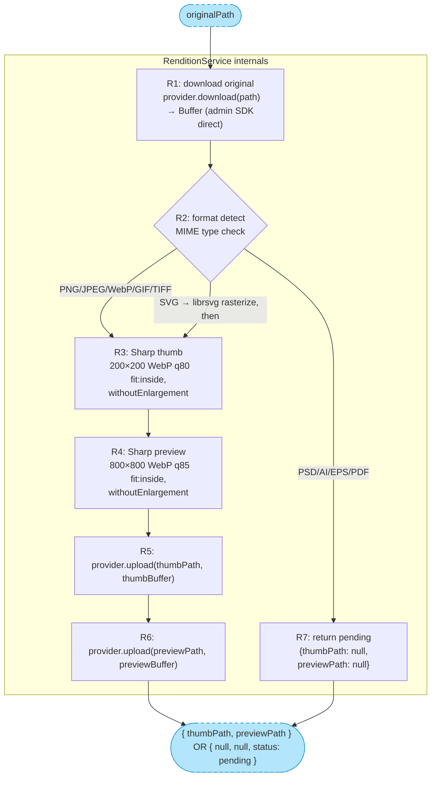
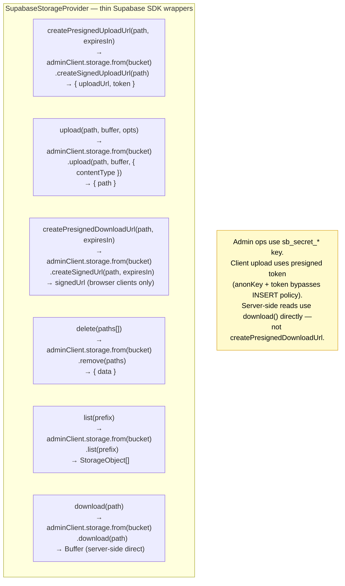

# H2: File Upload Pipeline — Breadboard

**Shape:** A — Synchronous Pipeline
**Consumer modeled:** P5 M1 (Artwork Library) as first consumer
**Slices:** V1 (happy path), V2 (dedup short-circuit), V3 (validation errors)

> **Reflection complete:** 6 smells found and fixed. See [Reflection Findings](#reflection-findings).

---

## Places

| #   | Place                   | Description                                                                      |
| --- | ----------------------- | -------------------------------------------------------------------------------- |
| P1  | Artwork Library (P5 M1) | Consumer UI — artwork grid, upload entry point                                   |
| P2  | Upload Modal            | Blocking modal — file selection, XHR upload, progress, completion states         |
| P3  | P5 M1 Server Actions    | `upload.action.ts` — orchestration, dedup check, artwork DB ops                  |
| P4  | H2 Service Layer        | `file-upload.service.ts`, `rendition.service.ts`, `supabase-storage.provider.ts` |

> Supabase Storage is an external system (S2), not a Place — you cannot navigate to it.
> The bootstrap script (`bootstrap-storage.ts`) is a one-time admin operation tagged to V1 prerequisite.

---

## UI Affordances

| #   | Place | Component       | Affordance                            | Control    | Wires Out | Returns To |
| --- | ----- | --------------- | ------------------------------------- | ---------- | --------- | ---------- |
| U1  | P1    | artwork-library | "Upload Artwork" button               | click      | → P2      | —          |
| U2  | P1    | artwork-grid    | artwork thumbnail card                | render     | —         | —          |
| U3  | P2    | upload-modal    | file dropzone (drag-drop or click)    | drop/click | → N0      | —          |
| U4  | P2    | upload-modal    | selected file info (name, size, type) | render     | —         | —          |
| U5  | P2    | upload-modal    | upload progress bar                   | render     | —         | —          |
| U6  | P2    | upload-modal    | "processing renditions" skeleton      | render     | —         | —          |
| U7  | P2    | upload-modal    | success — thumb preview + "Done"      | render     | —         | —          |
| U8  | P2    | upload-modal    | error message (MIME / size / network) | render     | —         | —          |
| U9  | P2    | upload-modal    | duplicate notice ("artwork exists")   | render     | —         | —          |
| U10 | P2    | upload-modal    | "Cancel" / "Close" button             | click      | → P1      | —          |

---

## Code Affordances

### P2 — Client-side (Upload Modal)

| #   | Place | Component    | Affordance                                                                                                | Control | Wires Out              | Returns To |
| --- | ----- | ------------ | --------------------------------------------------------------------------------------------------------- | ------- | ---------------------- | ---------- |
| N0  | P2    | upload-modal | `handleFileUpload(file)` — client orchestrator: hash → initiate → XHR upload → confirm → route to outcome | call    | → N1, → N6, → N2, → N8 | —          |
| N1  | P2    | upload-modal | `computeHash(file)` — Web Crypto `SHA-256` digest of `file.arrayBuffer()`                                 | call    | —                      | → N0       |
| N2  | P2    | upload-modal | `uploadToStorage(uploadUrl, token, file)` — direct `fetch PUT` to Supabase                                | call    | → S2, → S1             | → N0       |
| S1  | P2    | upload-modal | upload progress store (0–100 integer)                                                                     | write   | —                      | → U5       |

> **N0 sequencing:**
>
> 1. Calls N1 → receives `contentHash`; populates U4 (file info)
> 2. Calls N6 (`initiateUpload`) with hash + metadata
>    - Dedup match → N6 returns `{isDuplicate: true}` → N0 shows U9, returns early
>    - No match → N6 returns `{path, uploadUrl, token}` → continue
>    - Validation error → N6 propagates `UploadValidationError` → N0 shows U8, returns early
> 3. Calls N2 (XHR PUT to storage) → updates S1 (progress); on completion, N0 shows U6
> 4. Calls N8 (`confirmArtworkUpload`) → receives artwork record → N0 shows U7

### P3 — P5 M1 Server Actions

| #   | Place | Component     | Affordance                                                                                 | Control | Wires Out   | Returns To    |
| --- | ----- | ------------- | ------------------------------------------------------------------------------------------ | ------- | ----------- | ------------- |
| N6  | P3    | upload.action | `initiateUpload({entity, shopId, filename, mimeType, sizeBytes, contentHash})`             | call    | → N7, → N10 | → N0 (client) |
| N7  | P3    | artwork.repo  | `artworkVersions.findFirst({where: eq(contentHash, hash)})` — dedup check                  | query   | → S3        | → N6          |
| N8  | P3    | upload.action | `confirmArtworkUpload({path, contentHash})`                                                | call    | → N11, → N9 | → N0 (client) |
| N9  | P3    | artwork.repo  | `artworkVersions.insert({originalUrl, thumbUrl, previewUrl, contentHash, shopId, status})` | call    | → S3        | —             |

> **N6 conditional logic:**
>
> - N7 returns match → `isDuplicate: true` → N6 returns early → N0 shows U9 (no N10 call)
> - N7 returns no match → N6 calls N10 → receives `{path, uploadUrl, token}` → returns to N0
>
> **N8 logic:**
>
> - Calls N11 → receives `{originalUrl, thumbUrl, previewUrl, status}`
> - Calls N9 to persist artwork record
> - Returns artwork record to N0 → N0 updates UI (U6 → U7)

### P4 — H2 Service Layer

| #   | Place | Component                 | Affordance                                                                                                 | Control | Wires Out    | Returns To      |
| --- | ----- | ------------------------- | ---------------------------------------------------------------------------------------------------------- | ------- | ------------ | --------------- |
| N10 | P4    | file-upload.service       | `fileUploadService.createPresignedUploadUrl({entity, shopId, filename, mimeType, sizeBytes})`              | call    | → N12, → N13 | → N6 (P3)       |
| N11 | P4    | file-upload.service       | `fileUploadService.confirmUpload({path, contentHash})`                                                     | call    | → N14, → N13 | → N8 (P3)       |
| N12 | P4    | entity-configs            | `validateEntityConfig(entity, mimeType, sizeBytes)` — throws `UploadValidationError` on violation          | call    | —            | → N10           |
| N13 | P4    | supabase-storage.provider | `SupabaseStorageProvider` **[CHUNK]** — presigned URL gen, direct download, upload, delete                 | call    | → S2         | → N10, N11, N14 |
| N14 | P4    | rendition.service         | `RenditionService.generate(originalPath)` **[CHUNK]** — Sharp thumb + preview pipeline                     | call    | → N13        | → N11           |
| N16 | P4    | scripts/bootstrap-storage | `bootstrap-storage.ts` — idempotent bucket create + RLS policy apply (one-time admin, not consumer-facing) | invoke  | → S2         | —               |

> **N10 conditional logic:**
>
> - N12 throws `UploadValidationError` → propagates through N10 → N6 → N0 → N0 shows U8
> - N12 passes → N13 called for presigned URL → success path returns `{path, uploadUrl, token}`
>
> **N11 logic:**
>
> - Detects format by MIME type; Sharp-native → calls N14 (full renditions, `status: 'ready'`)
> - PSD/AI/EPS/PDF → skips N14, returns `{thumbUrl: null, previewUrl: null, status: 'pending'}`
> - Calls N13 for presigned download URLs of original + renditions
>
> **H2 public interface (full contract):**
>
> - `fileUploadService.createPresignedUploadUrl()` → N10
> - `fileUploadService.confirmUpload()` → N11
> - `fileUploadService.deleteFile(paths: string[])` → calls N13.delete — batch remove original + renditions
>
> _`deleteFile` is exercised during artwork version management (consumer calls it when a version is superseded), not the upload flow modeled in this breadboard. It is covered by H2 unit tests in implementation._

---

## Data Stores

| #   | Store                       | Description                                                  | Writers | Readers     |
| --- | --------------------------- | ------------------------------------------------------------ | ------- | ----------- |
| S1  | Upload progress (client)    | Integer 0–100 during XHR upload                              | N2      | U5          |
| S2  | Supabase Storage `artwork/` | External bucket — originals, thumbs, previews, frozen proofs | N2, N13 | N13, U7, U2 |
| S3  | `artwork_versions` table    | P5 M1 DB — artwork records with contentHash for dedup        | N9      | N7, U2      |

---

## Main Flow Diagram

```mermaid
flowchart TB
    subgraph P1["P1: Artwork Library (P5 M1)"]
        U1["U1: Upload Artwork button"]
        U2["U2: artwork grid thumbnails"]
    end

    subgraph P2["P2: Upload Modal"]
        U3["U3: file dropzone"]
        U4["U4: file info display"]
        U5["U5: upload progress bar"]
        U6["U6: rendition skeleton"]
        U7["U7: success thumb preview"]
        U8["U8: error message"]
        U9["U9: duplicate notice"]
        U10["U10: Cancel button"]

        N0["N0: handleFileUpload()"]
        N1["N1: computeHash(file)"]
        N2["N2: uploadToStorage() XHR"]
        S1["S1: progress 0-100"]
    end

    subgraph P3["P3: P5 M1 Server Actions"]
        N6["N6: initiateUpload()"]
        N7["N7: artworkVersions dedup query"]
        N8["N8: confirmArtworkUpload()"]
        N9["N9: artworkVersions.insert()"]
    end

    subgraph P4["P4: H2 Service Layer"]
        N10["N10: fileUploadService.createPresignedUploadUrl()"]
        N11["N11: fileUploadService.confirmUpload()"]
        N12["N12: validateEntityConfig()"]
        N13[["CHUNK: SupabaseStorageProvider"]]
        N14[["CHUNK: RenditionService"]]
        N16["N16: bootstrap-storage.ts"]
    end

    S2[("S2: Supabase Storage\n artwork/ bucket")]
    S3[("S3: artwork_versions\n table")]

    %% ── Navigation ──
    U1 --> P2
    U10 --> P1

    %% ── Step 1: file selected → orchestrator → hash ──
    U3 -->|file selected| N0
    N0 --> N1
    N1 -.->|contentHash| N0
    N0 -.->|filename, size, type| U4

    %% ── Step 2: orchestrator → server action → dedup + presigned URL ──
    N0 -->|hash + metadata| N6
    N6 --> N7
    N7 --> S3
    S3 -.->|result| N7
    N7 -.->|query result| N6
    N6 -.->|isDuplicate: true| N0
    N0 -.->|isDuplicate: true| U9
    N6 --> N10
    N10 --> N12
    N12 -.->|valid| N10
    %% Error propagates N12 → N10 → N6 → N0 (abbreviated):
    N12 -.->|UploadValidationError| N0
    N0 -.->|validation error| U8
    N10 --> N13
    N13 --> S2
    S2 -.->|presigned URL + token| N13
    N13 -.->|{path, uploadUrl, token}| N10
    N10 -.->|{path, uploadUrl, token}| N6
    N6 -.->|{path, uploadUrl, token}| N0

    %% ── Step 3: orchestrator → client XHR direct to storage ──
    N0 -->|uploadUrl + token| N2
    N2 --> S2
    N2 --> S1
    S1 -.-> U5
    N2 -.->|network error| U8
    N2 -.->|upload done| N0
    N0 -.->|upload done| U6

    %% ── Step 4: orchestrator → confirm + renditions ──
    N0 --> N8
    N8 --> N11
    N11 --> N14
    N14 --> N13
    N13 --> S2
    N13 -.->|rendition paths| N14
    N14 -.->|{thumbPath, previewPath}| N11
    N11 --> N13
    N13 -.->|presigned download URLs| N11
    N11 -.->|{originalUrl, thumbUrl, previewUrl, status}| N8

    %% ── Step 5: persist + close ──
    N8 --> N9
    N9 --> S3
    N8 -.->|artwork record| N0
    N0 -.->|artwork record| U7
    U7 -.->|thumbnail ready| U2

    %% ── Bootstrap (setup — one-time admin) ──
    N16 --> S2

    classDef ui fill:#ffb6c1,stroke:#d87093,color:#000
    classDef nonui fill:#d3d3d3,stroke:#808080,color:#000
    classDef store fill:#e6e6fa,stroke:#9370db,color:#000
    classDef chunk fill:#b3e5fc,stroke:#0288d1,color:#000,stroke-width:2px
    classDef extstore fill:#e6e6fa,stroke:#9370db,color:#000,stroke-dasharray:5 5

    class U1,U2,U3,U4,U5,U6,U7,U8,U9,U10 ui
    class N0,N1,N2,N6,N7,N8,N9,N10,N11,N12,N16 nonui
    class N13,N14 chunk
    class S1 store
    class S2,S3 extstore
```

---

## Chunk: RenditionService Internals

`RenditionService.generate(originalPath)` — collapses to N14 in the main diagram.



**Key behaviors:**

- R1 uses `adminClient.storage.from(bucket).download(path)` — server-side code uses admin SDK direct download, not presigned URLs (presigned = browser client pattern; no HTTP round-trip needed here)
- `fit: 'inside', withoutEnlargement: true` — preserves aspect ratio, never upscales small sources
- SVG: rasterized to PNG by libvips/librsvg before WebP conversion (Sharp handles natively)
- GIF: first frame extracted only
- TIFF: full layer support (multi-layer TIFF reads as single merged image)
- PSD/AI/EPS/PDF: returns `status: 'pending'` — stored original only; `ag-psd` preprocessing deferred to P5 M2

---

## Chunk: SupabaseStorageProvider Internals

`SupabaseStorageProvider` — collapses to N13 in the main diagram.



**Client upload pattern — bypass Vercel 4.5 MB limit:**

```
Server: createPresignedUploadUrl → { path, uploadUrl, token }
Client: fetch(uploadUrl, { method: 'PUT', body: file, headers: { Authorization: `Bearer ${token}` } })
```

No file bytes transit the Vercel function. Client uploads directly to Supabase Storage.

**Server-side read pattern — RenditionService (R1):**

```
Server: download(path) → adminClient.storage.from(bucket).download(path) → Buffer
```

No HTTP round-trip. No time-limited token management on the server. Direct admin SDK buffer access.

---

## Slices

### Slice Summary

| #   | Slice               | Parts (Shape A)   | Demo                                                                     |
| --- | ------------------- | ----------------- | ------------------------------------------------------------------------ |
| V1  | Happy path upload   | A1–A9 (all parts) | "Upload a 300 DPI PNG — thumbnail appears in artwork grid within ~2 sec" |
| V2  | Dedup short-circuit | A4 (dedup branch) | "Upload same PNG again — duplicate notice, zero storage writes"          |
| V3  | Validation errors   | A3, A4            | "Upload a .PDF at 400 MB — clear error message, no storage write"        |

> **V1 prerequisite:** `bootstrap-storage.ts` (N16) must run once before any upload is possible.
> Include as Wave 0 step in implementation planning.

---

### V1: Happy Path Upload (New File)

**Demo:** Upload a new 300 DPI PNG. Thumbnail and preview appear in artwork grid.

| #   | Component                 | Affordance                                             | New in V1 |
| --- | ------------------------- | ------------------------------------------------------ | --------- |
| U1  | artwork-library           | "Upload Artwork" button                                | ✓         |
| U3  | upload-modal              | file dropzone                                          | ✓         |
| U4  | upload-modal              | file info display                                      | ✓         |
| U5  | upload-modal              | upload progress bar                                    | ✓         |
| U6  | upload-modal              | rendition skeleton                                     | ✓         |
| U7  | upload-modal              | success thumbnail preview                              | ✓         |
| U10 | upload-modal              | Cancel button                                          | ✓         |
| U2  | artwork-grid              | artwork thumbnail card                                 | ✓         |
| N0  | upload-modal (client)     | `handleFileUpload(file)` orchestrator                  | ✓         |
| N1  | upload-modal (client)     | `computeHash(file)`                                    | ✓         |
| N2  | upload-modal (client)     | `uploadToStorage()` XHR                                | ✓         |
| S1  | upload-modal (client)     | upload progress store                                  | ✓         |
| N6  | upload.action             | `initiateUpload()`                                     | ✓         |
| N7  | artwork.repo              | `artworkVersions` dedup query                          | ✓         |
| N8  | upload.action             | `confirmArtworkUpload()`                               | ✓         |
| N9  | artwork.repo              | `artworkVersions.insert()`                             | ✓         |
| N10 | file-upload.service       | `fileUploadService.createPresignedUploadUrl()`         | ✓         |
| N11 | file-upload.service       | `fileUploadService.confirmUpload()`                    | ✓         |
| N12 | entity-configs            | `validateEntityConfig()`                               | ✓         |
| N13 | supabase-storage.provider | `SupabaseStorageProvider` (all methods)                | ✓         |
| N14 | rendition.service         | `RenditionService.generate()`                          | ✓         |
| N16 | scripts/bootstrap-storage | `bootstrap-storage.ts` (prerequisite, run before demo) | ✓         |
| S2  | Supabase Storage          | artwork bucket                                         | ✓         |
| S3  | DB                        | artwork_versions table                                 | ✓         |

---

### V2: Dedup Short-Circuit (Same File)

**Demo:** Upload the exact same PNG a second time. Duplicate notice shown, no storage write, no renditions generated.

Builds on V1. New affordances only:

| #   | Component    | Affordance                                                   | New in V2 |
| --- | ------------ | ------------------------------------------------------------ | --------- |
| U9  | upload-modal | duplicate notice ("This artwork already exists — [view it]") | ✓         |

**Wiring:** N7 returns match → N6 returns `{isDuplicate: true}` to N0 → N0 shows U9, returns early. N10 is never called. Zero storage writes.

No new server or storage code needed — this is a branch within N6 and N0 that already exists in V1's implementation.

---

### V3: Validation Errors

**Demo:** Upload a `.pdf` file at 400 MB → size limit exceeded → U8 shown immediately, no storage write.

Builds on V1. New affordances:

| #   | Component    | Affordance                                                   | New in V3 |
| --- | ------------ | ------------------------------------------------------------ | --------- |
| U8  | upload-modal | error message (MIME invalid / file too large / network fail) | ✓         |

**Error wiring:**

- `validateEntityConfig` throws `UploadValidationError` → propagates through N10 → N6 → N0 → N0 shows U8
- `uploadToStorage` XHR network fail → N2 returns error to N0 → N0 shows U8
- Validation happens in N12 **before** any storage call — no partial writes possible

> `fileUploadService.deleteFile()` is part of the H2 public interface but is exercised during artwork version management, not this upload flow. It is covered by H2 unit tests in implementation.

---

## Scope Coverage Verification

| Req  | Requirement                                                | Affordances                             | Covered? |
| ---- | ---------------------------------------------------------- | --------------------------------------- | -------- |
| R0   | Any vertical uploads without implementing storage plumbing | N10, N11, N13, N14, N16                 | ✅       |
| R1   | Client bypasses Vercel 4.5 MB limit via presigned URL      | N0 → N6 → N10 → N13 → N2 (XHR)          | ✅       |
| R2   | Content-addressed dedup — no duplicate storage write       | N7, N6 (dedup branch), N0 → U9          | ✅       |
| R3   | Per-entity file size + MIME enforcement                    | N12 (validateEntityConfig)              | ✅       |
| R4   | Thumb (200×200 WebP) + preview (800×800 WebP) generated    | N14 (RenditionService chunk)            | ✅       |
| R4.1 | PNG/JPEG/WebP/SVG/GIF/TIFF via Sharp natively              | N14 (R2 branch in chunk)                | ✅       |
| R4.2 | PSD/AI/EPS/PDF stored as-is; status = `pending`            | N14 (R7 branch in chunk)                | ✅       |
| R5   | Storage provider abstraction — swap = config change only   | N13 (IStorageProvider interface)        | ✅       |
| R6   | Path namespaced by entity + shop                           | N10 (path gen: `{entity}/{shopId}/...`) | ✅       |
| R7   | P5 M1 works as first consumer on H2 day one                | N6, N8 (P5 M1 server actions)           | ✅       |
| R8   | Interface async-ready — `status: 'ready' \| 'processing'`  | N11 → N8 → N0 → client                  | ✅       |

All requirements covered. Zero gaps.

---

## Quality Gate

- [x] Every Place passes the blocking test (Upload Modal blocks P1 — cannot interact with grid while it's open)
- [x] Every R from shaping has corresponding affordances (scope coverage table above)
- [x] Every U has at least one Wires Out or Returns To (U2, display Us fed by data stores or orchestrator)
- [x] Every N has a trigger and Wires Out or Returns To (N0–N14, N16 all connected; `deleteFile` excluded from tables per reflection)
- [x] S1 has writer (N2) and reader (U5); S2 has writers (N2, N13) and readers (N13, U7, U2); S3 has writer (N9) and reader (N7)
- [x] No dangling wire references
- [x] Slices defined with demo statements (V1, V2, V3)
- [x] Phase 2 throughout (all code affordances are server-side or client-side real implementation)
- [x] Mermaid diagram matches tables (tables are truth)
- [x] Chunks defined for RenditionService (N14) and SupabaseStorageProvider (N13)

---

## Reflection Findings

**Date:** 2026-03-02
**Method:** Naming test (one idiomatic verb per affordance), user story traces, wiring verification, pre-loaded question review.

---

### Smell 1 — N1 Naming Resistance: Missing Client Orchestrator ✅ Fixed

**Found:** `computeHash(file)` was named as a pure hash utility (one step) but the wiring showed it calling N6 (server action), receiving back a presigned URL, then calling N2 (XHR upload), then N8 (confirm). Four operations, one name. The naming test fails — "compute" covers hash calculation only, not orchestration of an upload sequence.

**Signal:** Could not describe N1's full behavior with one idiomatic verb. "Compute" ≠ "hash then orchestrate four-step upload."

**Fix:** Added N0 `handleFileUpload(file)` as explicit client orchestrator. U3 now wires to N0. N0 calls N1, N6, N2, N8 in sequence, and routes to U4/U5/U6/U7/U8/U9 based on outcomes. N1 stays as pure `computeHash` — one operation, one verb.

---

### Smell 2 — N2 Wrong Causality: XHR Calling a Server Action ✅ Fixed

**Found:** The original diagram showed N2 (`uploadToStorage` XHR) wiring to N8 (`confirmArtworkUpload`). N2's name describes one operation: the XHR PUT to storage. XHR upload functions don't call server actions — orchestrators do.

**Fix:** Removed N2 → N8 wire. N0 (orchestrator) calls N8 after N2 completes. N2 returns its result to N0.

---

### Smell 3 — N6 Naming Resistance: Dedup Branch Contradicts the Name ✅ Fixed

**Found:** `getPresignedUploadUrl` describes what the function does when there is NO duplicate. When there IS a duplicate, N6 returns `{isDuplicate: true}` without calling N10 or generating any URL. The name fails the naming test — half the code paths never produce a presigned URL. "Get" implies a single outcome.

**Fix:** Renamed N6 to `initiateUpload()`. "Initiate" covers both outcomes: initiate the dedup check, and (if no duplicate) initiate the presigned upload flow. One verb, all code paths.

---

### Smell 4 — N15 No Trigger: Quality Gate Violation ✅ Fixed

**Found:** `fileUploadService.deleteFile(paths: string[])` was listed in the P4 affordances table and drawn in the diagram with no UI affordance or code affordance triggering it in this breadboard. The quality gate requires every N to have a trigger.

**Root cause:** `deleteFile` is called during artwork version management (when a consumer replaces an artwork version), not during the upload flow modeled here. It is a real H2 method but belongs to a different flow.

**Fix:** Removed N15 from tables and diagram. Documented it under the H2 public interface note in P4 and in the V3 notes. It is covered by H2 unit tests in implementation but is not modeled in this breadboard.

---

### Smell 5 — RenditionService R1: Server-Side Code Using Browser Pattern ✅ Fixed

**Found:** R1 in the RenditionService chunk showed `provider.createPresignedDownloadUrl → fetch buffer`. Presigned download URLs are for browser clients — they are signed HTTP URLs that browsers fetch over the network. RenditionService runs server-side inside `confirmUpload`. Using a presigned URL for a server-to-storage read adds an unnecessary HTTP round-trip, involves time-limited token management on the server, and is architecturally mismatched (presigned = client-side access delegation pattern).

**Fix:** Changed R1 to `provider.download(path)` → `adminClient.storage.from(bucket).download(path)` → Buffer. Direct admin SDK download, no HTTP round-trip. Added `download(path)` method (P1f) to the SupabaseStorageProvider chunk. `createPresignedDownloadUrl` remains in the provider for future consumer use (e.g., serving artwork previews to browsers with expiring links).

---

### Smell 6 — N6 → U9 Direct Wire: Server Action Driving Client UI ✅ Fixed

**Found:** The original diagram showed `N6 -.->|isDuplicate: true| U9` — a server action directly routing to a client UI affordance. Tables are truth: N6's Returns To was `→ N1 (client)`. Server actions return data to their callers; they do not directly drive UI. UI routing belongs to the client orchestrator.

**Fix:** With N0 as orchestrator: N6 returns `{isDuplicate: true}` to N0, and N0 routes to U9. Diagram now flows N6 -.-> N0, N0 -.->|isDuplicate: true| U9. Table semantics (server actions return to callers) now match the diagram.

---

### Pre-Loaded Questions — Answers

| #   | Question                                                                           | Answer                                                                                                                                                                                                                                                                                       |
| --- | ---------------------------------------------------------------------------------- | -------------------------------------------------------------------------------------------------------------------------------------------------------------------------------------------------------------------------------------------------------------------------------------------- |
| 1   | Does `confirmArtworkUpload` reveal it's artwork-specific? Smell for a horizontal?  | **Not a smell.** `confirmArtworkUpload` is in P3 (consumer server action), not P4 (H2). Artwork-specific naming is correct — it's the consumer's own action, not H2's. H2's method is `fileUploadService.confirmUpload()` which is generic.                                                  |
| 2   | N7 (dedup query) in P3, not P4. Smell or correct?                                  | **Not a smell.** Correct per Decision D3 in shaping. Consumer owns dedup state. H2 is stateless. The dedup query hits `artwork_versions` — a consumer table H2 has no access to. Correct placement.                                                                                          |
| 3   | RenditionService downloads original by path rather than accepting a buffer. Smell? | **Partial smell.** The storage round-trip itself is unavoidable (file is in storage after the presigned XHR upload; RenditionService needs the buffer). But the mechanism was wrong — presigned URLs are a browser client pattern. Fixed in Smell 5: use admin SDK `download(path)` instead. |
| 4   | `deleteFile` (N15) has no UI trigger. Smell or expected?                           | **Quality gate violation.** Fixed in Smell 4. `deleteFile` belongs to a different flow (version management) and was removed from this breadboard's affordance tables.                                                                                                                        |
