# P4 M2: Pricing Editor UI — Breadboard

Affordance tables and wiring for Shape C (Surgical Rewire). Three editor surfaces:
decoration cost matrix, garment markup rules, rush tiers — all wired to the P4 M1
Supabase repository via new server actions.

---

## Places

| #   | Place                | Route                                  | Description                                           |
| --- | -------------------- | -------------------------------------- | ----------------------------------------------------- |
| P1  | Pricing Hub          | `/settings/pricing`                    | Template list + config tabs (async RSC + client wrapper) |
| P1.1 | Template List       | — (tab content)                        | Subplace: Screen Print / DTF template cards           |
| P1.2 | Markup Rules        | — (tab content)                        | Subplace: shop-level garment markup editor            |
| P1.3 | Rush Tiers          | — (tab content)                        | Subplace: shop-level rush tier table editor           |
| P2  | Screen Print Editor  | `/settings/pricing/screen-print/[id]`  | Template metadata + 2D sparse matrix grid             |
| P3  | DTF Editor           | `/settings/pricing/dtf/[id]`           | Template metadata + 1D qty curve                      |
| P4  | New Template Dialog  | — (modal, blocks P1)                   | Name + service type form; navigates to P2/P3 on create |
| P5  | Delete Confirm Dialog | — (modal, blocks P1)                  | Confirms before deleting a template                   |
| P6  | Backend              | —                                      | Server actions + SupabasePricingTemplateRepository    |

---

## UI Affordances

### P1 — Pricing Hub (tab bar)

| #   | Place | Component          | Affordance              | Control | Wires Out    | Returns To |
| --- | ----- | ------------------ | ----------------------- | ------- | ------------ | ---------- |
| U1  | P1    | pricing-hub-client | "Screen Print" tab      | click   | → N6 (activeTab) | —      |
| U2  | P1    | pricing-hub-client | "DTF" tab               | click   | → N6         | —          |
| U3  | P1    | pricing-hub-client | "Markup Rules" tab      | click   | → N6         | —          |
| U4  | P1    | pricing-hub-client | "Rush Tiers" tab        | click   | → N6         | —          |
| U5  | P1    | pricing-hub-client | "New Template" button   | click   | → P4         | —          |

### P1.1 — Template List (subplace)

| #   | Place | Component          | Affordance                    | Control | Wires Out          | Returns To |
| --- | ----- | ------------------ | ----------------------------- | ------- | ------------------ | ---------- |
| U6  | P1.1  | PricingTemplateCard | template card (name, type, isDefault badge) | render | — | ← S1  |
| U7  | P1.1  | PricingTemplateCard | "Open" action                 | click   | → P2 or P3         | —          |
| U8  | P1.1  | PricingTemplateCard | "Set as Default" toggle       | click   | → N11              | —          |
| U9  | P1.1  | PricingTemplateCard | "Delete" button               | click   | → N16              | —          |

### P1.2 — Markup Rules (subplace)

| #   | Place | Component           | Affordance                              | Control | Wires Out | Returns To |
| --- | ----- | ------------------- | --------------------------------------- | ------- | --------- | ---------- |
| U10 | P1.2  | GarmentMarkupEditor | category row (6×: tshirt/hoodie/hat/tank/polo/jacket) | render | — | ← S3 |
| U11 | P1.2  | GarmentMarkupEditor | markupMultiplier input (per category)   | change  | → S3      | —          |
| U12 | P1.2  | GarmentMarkupEditor | "Save All" button                       | click   | → N22     | —          |

### P1.3 — Rush Tiers (subplace)

| #   | Place | Component      | Affordance                          | Control | Wires Out | Returns To |
| --- | ----- | -------------- | ----------------------------------- | ------- | --------- | ---------- |
| U13 | P1.3  | RushTierEditor | tier table row (name, days, fee, pct) | render | —       | ← S4       |
| U14 | P1.3  | RushTierEditor | name input (per tier)               | change  | → S4      | —          |
| U15 | P1.3  | RushTierEditor | daysUnderStandard input             | change  | → S4      | —          |
| U16 | P1.3  | RushTierEditor | flatFee input                       | change  | → S4      | —          |
| U17 | P1.3  | RushTierEditor | pctSurcharge input                  | change  | → S4      | —          |
| U18 | P1.3  | RushTierEditor | "Add Tier" button                   | click   | → N27     | —          |
| U19 | P1.3  | RushTierEditor | "Remove" row button (per tier)      | click   | → N28     | —          |
| U20 | P1.3  | RushTierEditor | "Save All" button                   | click   | → N29     | —          |

### P4 — New Template Dialog

| #   | Place | Component             | Affordance            | Control | Wires Out | Returns To |
| --- | ----- | --------------------- | --------------------- | ------- | --------- | ---------- |
| U21 | P4    | new-template-dialog   | name input            | type    | → S5      | —          |
| U22 | P4    | new-template-dialog   | service type select (Screen Print / DTF) | change | → S5 | — |
| U23 | P4    | new-template-dialog   | "Create" button       | click   | → N8      | —          |
| U24 | P4    | new-template-dialog   | "Cancel" button       | click   | → P1      | —          |

### P5 — Delete Confirm Dialog

| #   | Place | Component               | Affordance               | Control | Wires Out | Returns To |
| --- | ----- | ----------------------- | ------------------------ | ------- | --------- | ---------- |
| U25 | P5    | delete-confirm-dialog   | template name display    | render  | —         | ← S2       |
| U26 | P5    | delete-confirm-dialog   | "Confirm Delete" button  | click   | → N17     | —          |
| U27 | P5    | delete-confirm-dialog   | "Cancel" button          | click   | → P1      | —          |

### P2 — Screen Print Editor

| #   | Place | Component             | Affordance                          | Control    | Wires Out   | Returns To |
| --- | ----- | --------------------- | ----------------------------------- | ---------- | ----------- | ---------- |
| U28 | P2    | sp-editor-client      | name input                          | change     | → S6        | —          |
| U29 | P2    | sp-editor-client      | interpolation mode toggle (linear\|step) | change | → S6       | —          |
| U30 | P2    | sp-editor-client      | setupFeePerColor input              | change     | → S6        | —          |
| U31 | P2    | sp-editor-client      | sizeUpchargeXxl input               | change     | → S6        | —          |
| U32 | P2    | sp-editor-client      | standardTurnaroundDays input        | change     | → S6        | —          |
| U33 | P2    | sp-editor-client      | isDefault badge                     | render     | —           | ← S6       |
| U34 | P2    | MatrixCellGrid (sp)   | grid (rows=qty anchors, cols=color counts) | render | —      | ← S7       |
| U35 | P2    | MatrixCellGrid (sp)   | cell click → inline input           | click      | → S8        | —          |
| U36 | P2    | MatrixCellGrid (sp)   | cell input blur / Enter             | blur/enter | → S7        | —          |
| U37 | P2    | MatrixCellGrid (sp)   | "Add Qty" row button                | click      | → N36       | —          |
| U38 | P2    | MatrixCellGrid (sp)   | "Add Color" column button           | click      | → N37       | —          |
| U39 | P2    | MatrixCellGrid (sp)   | remove row (×) button               | click      | → N38       | —          |
| U40 | P2    | MatrixCellGrid (sp)   | remove column (×) button            | click      | → N39       | —          |
| U41 | P2    | sp-editor-client      | "Save" header button                | click      | → N35       | —          |

### P3 — DTF Editor

| #   | Place | Component             | Affordance                                  | Control    | Wires Out | Returns To |
| --- | ----- | --------------------- | ------------------------------------------- | ---------- | --------- | ---------- |
| U42 | P3    | dtf-editor-client     | metadata inputs (same fields as P2)         | change     | → S9      | —          |
| U43 | P3    | MatrixCellGrid (dtf)  | grid (rows=qty anchors, single column — no color dim) | render | — | ← S10  |
| U44 | P3    | MatrixCellGrid (dtf)  | cell click → inline input                   | click      | → S11     | —          |
| U45 | P3    | MatrixCellGrid (dtf)  | cell input blur / Enter (colorCount=null)   | blur/enter | → S10     | —          |
| U46 | P3    | MatrixCellGrid (dtf)  | "Add Qty" row button                        | click      | → N42     | —          |
| U47 | P3    | MatrixCellGrid (dtf)  | remove row (×) button                       | click      | → N43     | —          |
| U48 | P3    | dtf-editor-client     | "Save" header button                        | click      | → N41     | —          |

---

## Code Affordances

### P1 — Hub page server load (Phase 2)

| #  | Place | Component          | Affordance                                            | Control | Wires Out         | Returns To |
| -- | ----- | ------------------ | ----------------------------------------------------- | ------- | ----------------- | ---------- |
| N1 | P1    | page.tsx (RSC)     | parallel fetch: listTemplates + getMarkupRules + getRushTiers | call | → N2, N3, N4 | → N5 (as initial props) |
| N2 | P6    | server action      | `listPricingTemplates(serviceType?)` → verifySession + repo.listTemplates(shopId) | call | → N60 | → N1 |
| N3 | P6    | server action      | `getMarkupRules()` → verifySession + repo.getMarkupRules(shopId) | call | → N66 | → N1 |
| N4 | P6    | server action      | `getRushTiers()` → verifySession + repo.getRushTiers(shopId) | call | → N68 | → N1 |

### P1 — Hub client state (Phase 1)

| #  | Place | Component          | Affordance                                 | Control | Wires Out | Returns To |
| -- | ----- | ------------------ | ------------------------------------------ | ------- | --------- | ---------- |
| N5 | P1    | pricing-hub-client | PricingHubClient (receives initial props)  | mount   | → S1, S3, S4 | —       |
| N6 | P1    | pricing-hub-client | `setActiveTab(tab)`                        | call    | → S12     | —          |

### P4 — Create template flow

| #  | Place | Component        | Affordance                                           | Control | Wires Out     | Returns To |
| -- | ----- | ---------------- | ---------------------------------------------------- | ------- | ------------- | ---------- |
| N7 | P4    | new-template-dialog | `setFormState({name, serviceType})`               | call    | → S5          | —          |
| N8 | P4    | new-template-dialog | `handleCreate()` → validates S5 → calls server action | call | → N9        | —          |
| N9 | P6    | server action    | `createPricingTemplate(data)` → verifySession + repo.upsertTemplate | call | → N61 | → N10 |
| N10| P4    | new-template-dialog | `router.push('/settings/pricing/{serviceType}/{id}')` | call | → P2 or P3 | — |

### P1 — isDefault toggle flow

| #  | Place | Component          | Affordance                                                              | Control | Wires Out    | Returns To |
| -- | ----- | ------------------ | ----------------------------------------------------------------------- | ------- | ------------ | ---------- |
| N11| P1    | pricing-hub-client | `handleSetDefault(id, serviceType)` → optimistic update S1 + calls server action | call | → S1 (optimistic), → N12 | — |
| N12| P6    | server action      | `setDefaultTemplate(id, serviceType)` → verifySession + repo.setDefaultTemplate (TX) | call | → N65 | → N11 (confirm or revert) |

### P1/P5 — Delete template flow

| #  | Place | Component             | Affordance                                                | Control | Wires Out  | Returns To |
| -- | ----- | --------------------- | --------------------------------------------------------- | ------- | ---------- | ---------- |
| N13| P1    | pricing-hub-client    | `handleDeleteClick(id)` → sets S2 (pending delete id)    | call    | → S2, → P5 | —         |
| N14| P5    | delete-confirm-dialog | `handleConfirmDelete(id)` → calls server action          | call    | → N15      | —          |
| N15| P6    | server action         | `deletePricingTemplate(id)` → verifySession + repo.deleteTemplate(id, shopId) | call | → N62 | → N16 |
| N16| P1    | pricing-hub-client    | `S1 = templates.filter(t => t.id !== id)` (remove from list) | call | → S1 | —       |

### P1.2 — Markup rules save flow

| #  | Place | Component           | Affordance                                                          | Control | Wires Out | Returns To |
| -- | ----- | ------------------- | ------------------------------------------------------------------- | ------- | --------- | ---------- |
| N22| P1.2  | GarmentMarkupEditor | `handleSaveMarkup()` → calls server action with S3 values          | call    | → N23     | —          |
| N23| P6    | server action       | `saveMarkupRules(rules[])` → verifySession + repo.upsertMarkupRules | call   | → N67     | → N24      |
| N24| P1.2  | GarmentMarkupEditor | `setRules(confirmedRules)` → S3 confirmed from server response     | call    | → S3      | —          |

### P1.3 — Rush tiers edit + save flow

| #  | Place | Component      | Affordance                                                       | Control | Wires Out | Returns To |
| -- | ----- | -------------- | ---------------------------------------------------------------- | ------- | --------- | ---------- |
| N27| P1.3  | RushTierEditor | `handleAddTier()` → append blank row to S4                      | call    | → S4      | —          |
| N28| P1.3  | RushTierEditor | `handleRemoveTier(index)` → filter S4 by index                  | call    | → S4      | —          |
| N29| P1.3  | RushTierEditor | `handleSaveTiers()` → derive displayOrder from position → calls server action | call | → N30 | —       |
| N30| P6    | server action  | `saveRushTiers(tiers[])` → verifySession + repo.upsertRushTiers | call    | → N69     | → N31      |
| N31| P1.3  | RushTierEditor | `setTiers(confirmedTiers)` → S4 confirmed from server response  | call    | → S4      | —          |

### P2 — Screen Print Editor save flow

| #  | Place | Component        | Affordance                                                             | Control | Wires Out       | Returns To |
| -- | ----- | ---------------- | ---------------------------------------------------------------------- | ------- | --------------- | ---------- |
| N35| P2    | sp-editor-client | `handleSave()` → calls metadata action then matrix action in sequence | call    | → N32, → N33    | —          |
| N32| P6    | server action    | `updatePricingTemplate(id, data)` → verifySession + repo.upsertTemplate({id, ...S6}) | call | → N61 | → N35, N41 |
| N33| P6    | server action    | `savePricingMatrix(templateId, cells[])` → verifySession + repo.upsertMatrixCells | call | → N64 | → N35, N41 |

> **Note:** N32 and N33 are shared server actions called by both SP (via N35) and DTF (via N41) editors.

### P2 — MatrixCellGrid operations (sp-mode)

| #  | Place | Component           | Affordance                                                        | Control | Wires Out | Returns To |
| -- | ----- | ------------------- | ----------------------------------------------------------------- | ------- | --------- | ---------- |
| N36| P2    | MatrixCellGrid (sp) | `handleAddQtyRow(qtyAnchor)` → insert blank cells for all existing color counts → S7 | call | → S7 | — |
| N37| P2    | MatrixCellGrid (sp) | `handleAddColorCol(colorCount)` → insert blank cells for all existing qty anchors → S7 | call | → S7 | — |
| N38| P2    | MatrixCellGrid (sp) | `handleRemoveRow(qtyAnchor)` → filter cells by anchor → S7       | call    | → S7      | —          |
| N39| P2    | MatrixCellGrid (sp) | `handleRemoveCol(colorCount)` → filter cells by color → S7       | call    | → S7      | —          |

### P3 — DTF Editor save + matrix operations

| #  | Place | Component             | Affordance                                                             | Control | Wires Out | Returns To |
| -- | ----- | --------------------- | ---------------------------------------------------------------------- | ------- | --------- | ---------- |
| N41| P3    | dtf-editor-client     | `handleSave()` → calls N32 (metadata) + N33 (cells, colorCount=null) in sequence | call | → N32, → N33 | — |
| N42| P3    | MatrixCellGrid (dtf)  | `handleAddQtyRow(qtyAnchor)` → insert blank cell (colorCount=null) → S10 | call | → S10 | —        |
| N43| P3    | MatrixCellGrid (dtf)  | `handleRemoveRow(qtyAnchor)` → filter cells by anchor → S10           | call    | → S10     | —          |

### P2 — SP Editor page load (Phase 2)

| #  | Place | Component       | Affordance                                                            | Control | Wires Out    | Returns To |
| -- | ----- | --------------- | --------------------------------------------------------------------- | ------- | ------------ | ---------- |
| N34| P2    | page.tsx (RSC)  | `getPricingTemplate(id)` → fetches template + cells                   | call    | → N63        | → S6, S7 (via props to client) |

### P3 — DTF Editor page load (Phase 2)

| #  | Place | Component       | Affordance                                                            | Control | Wires Out    | Returns To |
| -- | ----- | --------------- | --------------------------------------------------------------------- | ------- | ------------ | ---------- |
| N44| P3    | page.tsx (RSC)  | `getPricingTemplate(id)` → fetches template + cells (colorCount=null) | call   | → N63        | → S9, S10 (via props to client) |

### P6 — Backend (Repository methods)

| #  | Place | Component                        | Affordance                                          | Control | Wires Out | Returns To |
| -- | ----- | -------------------------------- | --------------------------------------------------- | ------- | --------- | ---------- |
| N60| P6    | SupabasePricingTemplateRepository | `listTemplates(shopId)`                            | call    | → DB      | → N2       |
| N61| P6    | SupabasePricingTemplateRepository | `upsertTemplate(data)` (insert or update)          | call    | → DB      | → N9, N32  |
| N62| P6    | SupabasePricingTemplateRepository | `deleteTemplate(id, shopId)` **NEW**               | call    | → DB      | → N15      |
| N63| P6    | SupabasePricingTemplateRepository | `getTemplateById(id)` → template + cells[]         | call    | → DB      | → N34, N44 |
| N64| P6    | SupabasePricingTemplateRepository | `upsertMatrixCells(templateId, cells[])` TX: delete+insert | call | → DB | → N33   |
| N65| P6    | SupabasePricingTemplateRepository | `setDefaultTemplate(shopId, id, svcType)` **NEW** TX: clear old isDefault, set new | call | → DB | → N12 |
| N66| P6    | SupabasePricingTemplateRepository | `getMarkupRules(shopId)`                           | call    | → DB      | → N3       |
| N67| P6    | SupabasePricingTemplateRepository | `upsertMarkupRules(shopId, rules[])` TX             | call    | → DB      | → N23      |
| N68| P6    | SupabasePricingTemplateRepository | `getRushTiers(shopId)` ordered by displayOrder     | call    | → DB      | → N4       |
| N69| P6    | SupabasePricingTemplateRepository | `upsertRushTiers(shopId, tiers[])` TX              | call    | → DB      | → N30      |

---

## Data Stores

| #  | Place | Store                    | Description                                                             |
| -- | ----- | ------------------------ | ----------------------------------------------------------------------- |
| S1 | P1    | `templates[]`            | All templates for shop (from DB); updated optimistically on set-default/delete |
| S2 | P1    | `pendingDeleteId`        | Template ID currently awaiting delete confirmation (shown in P5 dialog) |
| S3 | P1.2  | `markupRules[]`          | Shop markup rules; edited locally, flushed on Save All                  |
| S4 | P1.3  | `rushTiers[]`            | Shop rush tiers with displayOrder from row position; flushed on Save All |
| S5 | P4    | `newTemplateForm`        | `{ name: string, serviceType: 'screen_print' \| 'dtf' }` form state     |
| S6 | P2    | `templateMeta`           | SP template metadata: name, interpolationMode, setupFeePerColor, sizeUpchargeXxl, standardTurnaroundDays |
| S7 | P2    | `cells[]`                | SP matrix cells: `{ qtyAnchor, colorCount, costPerPiece }`; mutated by grid operations |
| S8 | P2    | `activeCell`             | `{ qtyAnchor, colorCount } \| null` — which cell is currently in edit mode |
| S9 | P3    | `templateMeta`           | DTF template metadata (same shape as S6)                               |
| S10| P3    | `cells[]`                | DTF cells: `{ qtyAnchor, colorCount: null, costPerPiece }`             |
| S11| P3    | `activeCell`             | `{ qtyAnchor } \| null` — DTF active edit cell                          |
| S12| P1    | `activeTab`              | Current active tab: `'screen_print' \| 'dtf' \| 'markup' \| 'rush_tiers'` |

---

## Mermaid Diagram

```mermaid
flowchart TB
    subgraph P1["P1: Pricing Hub"]
        subgraph P1_1["P1.1: Template List"]
            U5["U5: New Template btn"]
            U6["U6: PricingTemplateCard"]
            U7["U7: Open action"]
            U8["U8: Set Default toggle"]
            U9["U9: Delete button"]
        end
        subgraph P1_2["P1.2: Markup Rules"]
            U11["U11: multiplier inputs"]
            U12["U12: Save All"]
            N22["N22: handleSaveMarkup"]
            S3[("S3: markupRules[]")]
        end
        subgraph P1_3["P1.3: Rush Tiers"]
            U18["U18: Add Tier"]
            U19["U19: Remove row"]
            U20["U20: Save All"]
            N27["N27: handleAddTier"]
            N28["N28: handleRemoveTier"]
            N29["N29: handleSaveTiers"]
            S4[("S4: rushTiers[]")]
        end
        N1["N1: page.tsx RSC (parallel fetch)"]
        N5["N5: PricingHubClient (mount)"]
        N6["N6: setActiveTab"]
        N11["N11: handleSetDefault (optimistic)"]
        N13["N13: handleDeleteClick"]
        N16["N16: remove from S1"]
        S1[("S1: templates[]")]
        S2[("S2: pendingDeleteId")]
        S12[("S12: activeTab")]
    end

    subgraph P4["P4: New Template Dialog"]
        U21["U21: name input"]
        U22["U22: service type"]
        U23["U23: Create"]
        U24["U24: Cancel"]
        N8["N8: handleCreate"]
        N10["N10: router.push"]
        S5[("S5: newTemplateForm")]
    end

    subgraph P5["P5: Delete Confirm"]
        U25["U25: template name"]
        U26["U26: Confirm Delete"]
        N14["N14: handleConfirmDelete"]
    end

    subgraph P2["P2: Screen Print Editor"]
        N34["N34: page.tsx RSC"]
        U28["U28-U32: metadata inputs"]
        U34["U34: MatrixCellGrid (sp)"]
        U37["U37: Add Qty row"]
        U38["U38: Add Color col"]
        U41["U41: Save button"]
        N35["N35: handleSave"]
        N36["N36: handleAddQtyRow"]
        N37["N37: handleAddColorCol"]
        S6[("S6: templateMeta")]
        S7[("S7: cells[]")]
    end

    subgraph P3["P3: DTF Editor"]
        N44["N44: page.tsx RSC"]
        U42["U42: metadata inputs"]
        U43["U43: MatrixCellGrid (dtf)"]
        U46["U46: Add Qty row"]
        U48["U48: Save button"]
        N41["N41: handleSave"]
        N42["N42: handleAddQtyRow (dtf)"]
        S9[("S9: templateMeta")]
        S10[("S10: cells[] colorCount=null")]
    end

    subgraph P6["P6: Backend"]
        N9["N9: createPricingTemplate"]
        N12["N12: setDefaultTemplate"]
        N15["N15: deletePricingTemplate"]
        N23_sa["N23: saveMarkupRules"]
        N30_sa["N30: saveRushTiers"]
        N32["N32: updatePricingTemplate"]
        N33["N33: savePricingMatrix"]
        N60["N60: repo.listTemplates"]
        N61["N61: repo.upsertTemplate"]
        N62["N62: repo.deleteTemplate ★NEW"]
        N64["N64: repo.upsertMatrixCells"]
        N65["N65: repo.setDefaultTemplate ★NEW TX"]
        DB[("Supabase DB")]
    end

    %% Hub initialization
    N1 --> N60
    N1 --> N5
    N5 --> S1
    N5 --> S3
    N5 --> S4
    S1 -.-> U6
    N6 --> S12

    %% Tab navigation
    U5 --> P4
    U7 --> P2
    U7 --> P3

    %% isDefault flow
    U8 --> N11
    N11 --> S1
    N11 --> N12
    N12 --> N65
    N65 --> DB

    %% Delete flow
    U9 --> N13
    N13 --> S2
    N13 --> P5
    S2 -.-> U25
    U26 --> N14
    N14 --> N15
    N15 --> N62
    N62 --> DB
    N15 -.-> N16
    N16 --> S1

    %% Create template
    U21 --> S5
    U22 --> S5
    U23 --> N8
    S5 -.-> N8
    N8 --> N9
    N9 --> N61
    N61 --> DB
    N9 -.-> N10
    N10 --> P2
    N10 --> P3
    U24 --> P1

    %% Markup save
    U11 --> S3
    U12 --> N22
    N22 --> N23_sa
    N23_sa --> DB

    %% Rush tiers
    U18 --> N27
    U19 --> N28
    N27 --> S4
    N28 --> S4
    U20 --> N29
    N29 --> N30_sa
    N30_sa --> DB

    %% SP Editor
    N34 --> P2
    U28 --> S6
    S6 -.-> U34
    S7 -.-> U34
    U37 --> N36
    U38 --> N37
    N36 --> S7
    N37 --> S7
    U41 --> N35
    N35 --> N32
    N35 --> N33
    N32 --> N61
    N33 --> N64
    N64 --> DB

    %% DTF Editor
    N44 --> P3
    U42 --> S9
    S10 -.-> U43
    U46 --> N42
    N42 --> S10
    U48 --> N41
    N41 --> N32
    N41 --> N33

    classDef ui fill:#ffb6c1,stroke:#d87093,color:#000
    classDef nonui fill:#d3d3d3,stroke:#808080,color:#000
    classDef store fill:#e6e6fa,stroke:#9370db,color:#000
    classDef db fill:#b3e5fc,stroke:#0288d1,color:#000

    class U5,U6,U7,U8,U9,U11,U12,U18,U19,U20,U21,U22,U23,U24,U25,U26,U28,U34,U37,U38,U41,U42,U43,U46,U48 ui
    class N1,N5,N6,N8,N9,N10,N11,N12,N13,N14,N15,N16,N22,N23_sa,N27,N28,N29,N30_sa,N32,N33,N34,N35,N36,N37,N41,N42,N44,N60,N61,N62,N64,N65 nonui
    class S1,S2,S3,S4,S5,S6,S7,S9,S10,S12 store
    class DB db
```

---

## Vertical Slices

### Slice Summary

| #  | Slice                            | Shape C Parts    | Demo                                                              |
| -- | -------------------------------- | ---------------- | ----------------------------------------------------------------- |
| V1 | Hub with real template data      | C3, C4, C11.4   | "Navigate to /settings/pricing — see real templates from Supabase" |
| V2 | Create + navigate to editor      | C5, C1.3         | "Click New Template → fill name → Create → land on SP editor"    |
| V3 | SP editor saves matrix + meta    | C6, C8, C1.4, C1.6 | "Open SP template → edit cell → Save → refresh shows persisted data" |
| V4 | DTF editor 1D save               | C7, C8 (dtf-mode), C1.4, C1.6 | "Open DTF template → add qty anchor → Save → persists" |
| V5 | isDefault toggle                 | C3, C1.7, C2.2   | "Toggle a template default → old badge clears → new one shows"   |
| V6 | Delete template                  | C1.5, C2.1       | "Click Delete → confirm → template removed from list"            |
| V7 | Garment Markup saves             | C9 (Markup), C1.9 | "Open Markup tab → set hoodie to 2.5× → Save All → persists"   |
| V8 | Rush Tier saves (add/remove/save) | C10, C1.11      | "Add Emergency 4h tier → fill fields → Save → appears in list"  |
| V9 | Matrix add/remove rows+columns   | C8.5, C8.6, C8.7 | "Add Qty 144 → new row with blank cells → remove it → row gone" |

---

### V1 — Hub with real template data

**Demo:** "Navigate to `/settings/pricing` — PricingTemplateCards show real templates from Supabase"

| #  | Component           | Affordance                      | Control | Wires Out    | Returns To |
| -- | ------------------- | ------------------------------- | ------- | ------------ | ---------- |
| N1 | page.tsx (RSC)      | parallel fetch                  | call    | → N2, N3, N4 | → N5       |
| N2 | server action       | `listPricingTemplates`          | call    | → N60        | → N1       |
| N5 | pricing-hub-client  | mount with initial props        | mount   | → S1, S3, S4 | —          |
| N6 | pricing-hub-client  | `setActiveTab`                  | call    | → S2         | —          |
| U1 | pricing-hub-client  | "Screen Print" tab              | click   | → N6         | —          |
| U2 | pricing-hub-client  | "DTF" tab                       | click   | → N6         | —          |
| U6 | PricingTemplateCard | template card render            | render  | —            | ← S1       |

---

### V2 — Create + navigate to editor

**Demo:** "Click New Template → dialog opens → enter name → Create → land on SP or DTF editor"

| #  | Component              | Affordance                   | Control | Wires Out   | Returns To |
| -- | ---------------------- | ---------------------------- | ------- | ----------- | ---------- |
| U5 | pricing-hub-client     | "New Template" button        | click   | → P4        | —          |
| U21| new-template-dialog    | name input                   | type    | → S5        | —          |
| U22| new-template-dialog    | service type select          | change  | → S5        | —          |
| U23| new-template-dialog    | "Create" button              | click   | → N8        | —          |
| N8 | new-template-dialog    | `handleCreate()`             | call    | → N9        | —          |
| N9 | server action          | `createPricingTemplate(data)` | call   | → N61       | → N10      |
| N10| new-template-dialog    | `router.push(editorPath)`    | call    | → P2 or P3  | —          |

---

### V3 — Screen Print editor saves matrix + meta

**Demo:** "Open SP template → edit a cell → change setup fee → Save → refresh shows persisted data"

| #  | Component            | Affordance                          | Control    | Wires Out   | Returns To |
| -- | -------------------- | ----------------------------------- | ---------- | ----------- | ---------- |
| N34| page.tsx (RSC)       | `getPricingTemplate(id)`            | call       | → N63       | → S6, S7   |
| U28| sp-editor-client     | metadata inputs (name, etc)         | change     | → S6        | —          |
| U34| MatrixCellGrid (sp)  | grid render                         | render     | —           | ← S7       |
| U35| MatrixCellGrid (sp)  | cell click → edit mode              | click      | → S8        | —          |
| U36| MatrixCellGrid (sp)  | cell blur/Enter → commit            | blur/enter | → S7        | —          |
| U41| sp-editor-client     | "Save" button                       | click      | → N35       | —          |
| N35| sp-editor-client     | `handleSave()`                      | call       | → N32, N33  | —          |
| N32| server action        | `updatePricingTemplate(id, data)`   | call       | → N61       | —          |
| N33| server action        | `savePricingMatrix(templateId, cells[])` | call  | → N64       | —          |

---

### V4 — DTF editor 1D save

**Demo:** "Open DTF template → enter price for qty 24 → Save → persists"

| #  | Component            | Affordance                          | Control    | Wires Out   | Returns To |
| -- | -------------------- | ----------------------------------- | ---------- | ----------- | ---------- |
| N44| page.tsx (RSC)       | `getPricingTemplate(id)` (dtf)      | call       | → N63       | → S9, S10  |
| U42| dtf-editor-client    | metadata inputs                     | change     | → S9        | —          |
| U43| MatrixCellGrid (dtf) | grid render (single column)         | render     | —           | ← S10      |
| U44| MatrixCellGrid (dtf) | cell click → edit mode              | click      | → S11       | —          |
| U45| MatrixCellGrid (dtf) | cell blur/Enter (colorCount=null)   | blur/enter | → S10       | —          |
| U48| dtf-editor-client    | "Save" button                       | click      | → N41       | —          |
| N41| dtf-editor-client    | `handleSave()` (dtf)                | call       | → N32, N33  | —          |

---

### V5 — isDefault toggle

**Demo:** "Click Set Default on Template B → Template A's default badge clears → Template B shows Default"

| #  | Component          | Affordance                              | Control | Wires Out       | Returns To |
| -- | ------------------ | --------------------------------------- | ------- | --------------- | ---------- |
| U8 | PricingTemplateCard | "Set as Default" toggle               | click   | → N11           | —          |
| N11| pricing-hub-client | `handleSetDefault()` (optimistic S1)   | call    | → S1, → N12     | —          |
| N12| server action      | `setDefaultTemplate(id, serviceType)`  | call    | → N65           | → N11 confirm |
| N65| repo               | `setDefaultTemplate()` TX (clear+set)  | call    | → DB            | → N12      |

---

### V6 — Delete template

**Demo:** "Click Delete on template → confirm dialog → Confirm → template removed from list"

| #  | Component              | Affordance                              | Control | Wires Out  | Returns To |
| -- | ---------------------- | --------------------------------------- | ------- | ---------- | ---------- |
| U9 | PricingTemplateCard    | "Delete" button                         | click   | → N13      | —          |
| N13| pricing-hub-client     | `handleDeleteClick(id)` → open P5      | call    | → S2, → P5 | —          |
| U26| delete-confirm-dialog  | "Confirm Delete" button                 | click   | → N14      | —          |
| N14| delete-confirm-dialog  | `handleConfirmDelete()`                 | call    | → N15      | —          |
| N15| server action          | `deletePricingTemplate(id)`             | call    | → N62      | → N16      |
| N16| pricing-hub-client     | `S1 = templates.filter(...)`            | call    | → S1       | —          |

---

### V7 — Garment Markup saves

**Demo:** "Open Markup Rules tab → change Hoodie to 2.5× → Save All → confirms persistence"

| #  | Component           | Affordance                       | Control | Wires Out   | Returns To |
| -- | ------------------- | -------------------------------- | ------- | ----------- | ---------- |
| N3 | server action       | `getMarkupRules()` (hub init)    | call    | → N66       | → N1       |
| U3 | pricing-hub-client  | "Markup Rules" tab               | click   | → N6        | —          |
| U10| GarmentMarkupEditor | category rows render             | render  | —           | ← S3       |
| U11| GarmentMarkupEditor | multiplier input                 | change  | → S3        | —          |
| U12| GarmentMarkupEditor | "Save All" button                | click   | → N22       | —          |
| N22| GarmentMarkupEditor | `handleSaveMarkup()`             | call    | → N23       | —          |
| N23| server action       | `saveMarkupRules(rules[])`       | call    | → N67       | → N24      |

---

### V8 — Rush Tiers saves (add/remove/save)

**Demo:** "Open Rush Tiers tab → Add Tier → fill Emergency 4h → Save All → persists"

| #  | Component      | Affordance                        | Control | Wires Out   | Returns To |
| -- | -------------- | --------------------------------- | ------- | ----------- | ---------- |
| N4 | server action  | `getRushTiers()` (hub init)       | call    | → N68       | → N1       |
| U4 | pricing-hub-client | "Rush Tiers" tab              | click   | → N6        | —          |
| U18| RushTierEditor | "Add Tier" button                 | click   | → N27       | —          |
| U19| RushTierEditor | "Remove" row button               | click   | → N28       | —          |
| U14-U17 | RushTierEditor | field inputs (name, days, fee, pct) | change | → S4    | —          |
| U20| RushTierEditor | "Save All" button                 | click   | → N29       | —          |
| N29| RushTierEditor | `handleSaveTiers()`               | call    | → N30       | —          |
| N30| server action  | `saveRushTiers(tiers[])`          | call    | → N69       | → N31      |

---

### V9 — Matrix add/remove rows + columns

**Demo:** "In SP editor: click Add Qty → enter 144 → new row with blank cells → remove it → row disappears"

| #  | Component           | Affordance                               | Control | Wires Out | Returns To |
| -- | ------------------- | ---------------------------------------- | ------- | --------- | ---------- |
| U37| MatrixCellGrid (sp) | "Add Qty" row button                     | click   | → N36     | —          |
| N36| MatrixCellGrid (sp) | `handleAddQtyRow(qtyAnchor)`             | call    | → S7      | —          |
| U38| MatrixCellGrid (sp) | "Add Color" column button                | click   | → N37     | —          |
| N37| MatrixCellGrid (sp) | `handleAddColorCol(colorCount)`          | call    | → S7      | —          |
| U39| MatrixCellGrid (sp) | remove row × button                      | click   | → N38     | —          |
| N38| MatrixCellGrid (sp) | `handleRemoveRow(qtyAnchor)`             | call    | → S7      | —          |
| U40| MatrixCellGrid (sp) | remove column × button                   | click   | → N39     | —          |
| N39| MatrixCellGrid (sp) | `handleRemoveCol(colorCount)`            | call    | → S7      | —          |

---

## Phase 2 Code Affordances

All server actions are Phase 2 (database-backed). Phase 1 equivalents in P1 did not exist — the hub was fully client-side with mock data.

| ID  | Place | Affordance                        | Replaces / Notes                                     |
| --- | ----- | --------------------------------- | ---------------------------------------------------- |
| N2  | P6    | `listPricingTemplates`            | Replaces mock `allScreenPrintTemplates` array        |
| N3  | P6    | `getMarkupRules`                  | New — no Phase 1 equivalent                          |
| N4  | P6    | `getRushTiers`                    | New — no Phase 1 equivalent                          |
| N9  | P6    | `createPricingTemplate`           | Replaces local state `addTemplate()` mock            |
| N12 | P6    | `setDefaultTemplate`              | New — isDefault was decorative UI only in Phase 1    |
| N15 | P6    | `deletePricingTemplate`           | New — no delete existed in Phase 1                   |
| N23 | P6    | `saveMarkupRules`                 | New surface entirely                                 |
| N30 | P6    | `saveRushTiers`                   | New surface entirely                                 |
| N32 | P6    | `updatePricingTemplate`           | Replaces Phase 1 save to old entity (incompatible)   |
| N33 | P6    | `savePricingMatrix`               | Replaces Phase 1 matrix save (incompatible entity)   |

---

## Scope Coverage Verification

| Req | Requirement                                                                                 | Affordances                      | Covered? |
| --- | ------------------------------------------------------------------------------------------- | -------------------------------- | -------- |
| R0  | Gary can view all named pricing templates and create new ones                               | N1, N2, U6, U5, N9              | Yes      |
| R1  | Gary can edit the decoration cost matrix (sparse grid: qty_anchor × color_count → costPerPiece) | U34-U36, N36-N39, N33, N64   | Yes      |
| R2  | Gary can configure garment markup per category for the shop                                  | U10-U12, S3, N22, N23, N67     | Yes      |
| R3  | Gary can configure rush tiers (name, days, flatFee, pct) for the shop                       | U13-U20, S4, N29, N30, N69     | Yes      |
| R4  | DTF templates collapse to 1D qty curve (colorCount=null, no color-count column)             | U43-U48, S10, N42-N43           | Yes      |
| R5  | isDefault toggle: setting new default clears old one (transactional)                         | U8, N11, N12, N65 (TX)          | Yes      |
| R6  | Interpolation mode (linear\|step) configurable and visible in editor                         | U29, S6, N32                    | Yes      |
| R7  | PrintLife-style inline cell editing grid (click → input → commit)                            | U35, U36, S8, S11               | Yes      |
| R8  | All mutations via P4 M1 repository; no mock data in production paths                         | N9, N12, N15, N23, N30, N32, N33 → N60-N69 | Yes |
| R9  | Phase 1 routing, breadcrumbs, and tab navigation preserved                                  | P1, P2, P3 routes maintained; C4 card adaptation | Yes |

---

## Quality Gate

- [x] Every Place passes the blocking test (P4, P5 are blocking modals; P2, P3 are full-page navigations)
- [x] Every R from shaping has corresponding affordances (scope coverage complete)
- [x] Every U has at least one Wires Out or Returns To
- [x] Every N has a trigger and either Wires Out or Returns To
- [x] Every S has at least one reader and one writer
- [x] No dangling wire references
- [x] V1–V9 defined with demo statements
- [x] Phase 2 indicators on server action affordances
- [x] Two new port methods (N62, N65) explicitly called out as NEW
